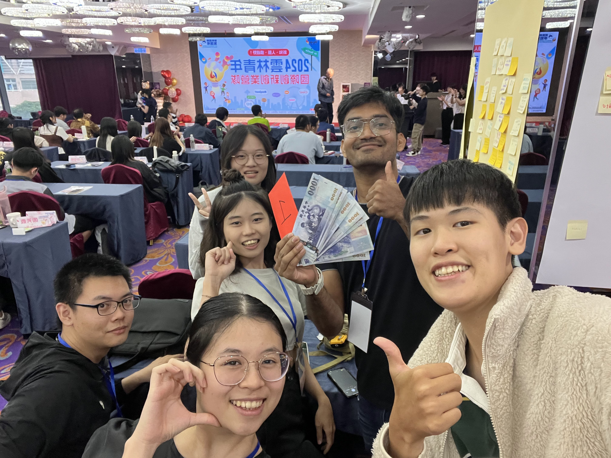
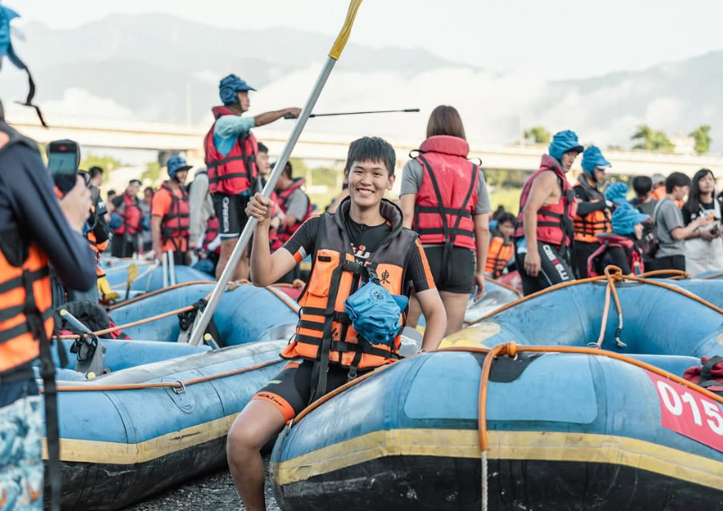

slug: Story
# Writing My Own Story

I believe life is less about finding yourself and more about creating yourself. At 20, I transitioned from seeing life through a lens of limitation to embracing the role of the protagonist in my own journey. This shift sparked a decade of entrepreneurship, international collaboration, and a relentless pursuit of excellence.

## Building Bridges & Breaking Barriers

My professional journey is rooted in social impact and education. Alongside a global team of Canadian and Indian partners, I co-founded a project dedicated to providing accessible education for blind children. Driven by the belief that communication should never be a "wall," I also founded an English learning community to help others find their voice in a second language—a challenge I once faced and overcame myself.

## The Spirit of Discipline

I thrive in high-pressure, high-energy environments. My background as a competitive athlete—including 10 Hackathon championships and a first-place title in roller skating—has instilled in me the discipline and resilience I bring to every project. Whether it’s presenting at academic conferences in Bangkok or navigating the complexities of a new startup, I approach every challenge with the same "finish line" mentality.

## A Lifelong Explorer
Today, my journey is defined by a curiosity for the world and its people. From the depths of the ocean as a diver to the nuances of learning Spanish, German, and Thai, I am constantly seeking new perspectives. I am a firm believer that the connections we make and the cultures we experience are what truly color our lives.

I am still writing my story, enjoying the process, and looking for the next great adventure to undertake.

