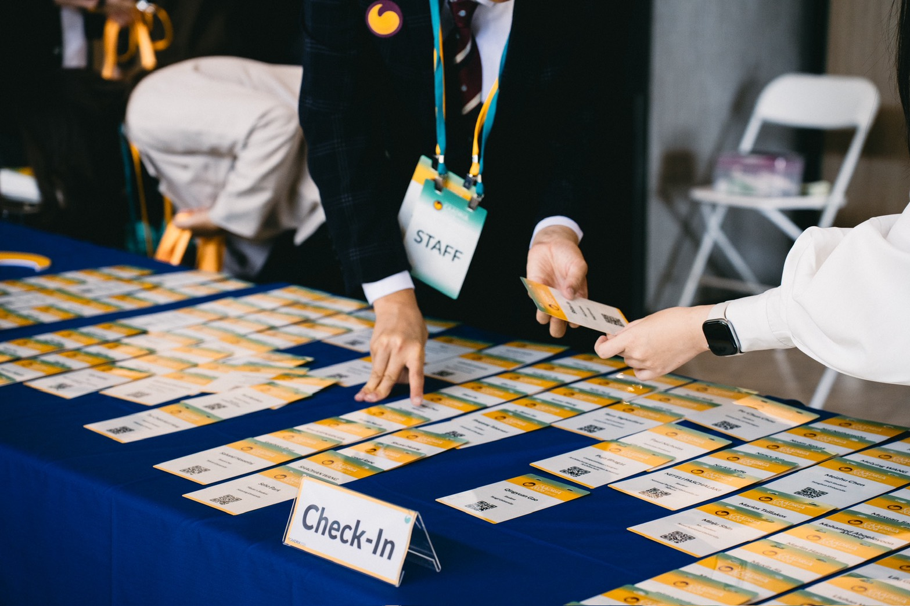
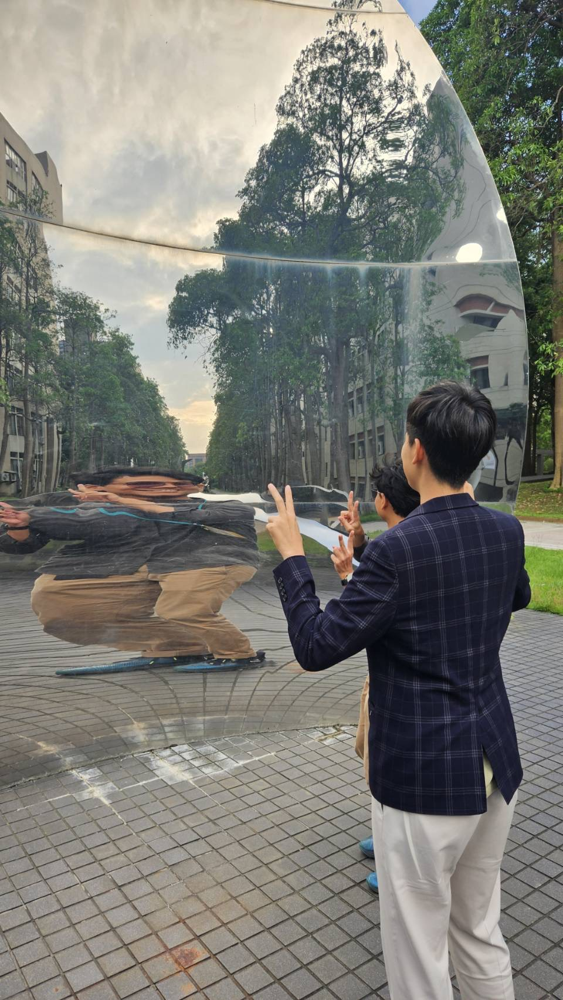
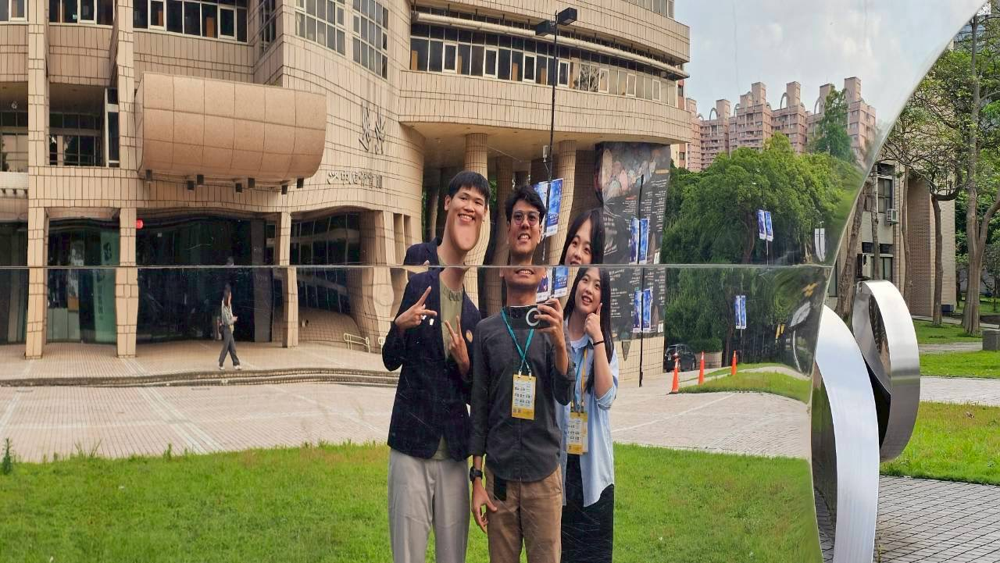

# Do Your Best, and Always Ask: "Is There Anything I Can Help With?"

These are the things I learned:

- Actively participate in the conference and offer timely assistance to increase interaction and visibility
- Always carry your laptop and stay present in the office to show commitment and professionalism
- Build familiarity through consistent attendance and daily conversations, laying the groundwork for future collaboration
- Prepare business cards to help expand your network
- Even when your contribution seems limited, keep showing up — trust accumulates over time
- Stay open to asking questions and learning from others
- Have regular weekly check-ins with your mentor to maintain a steady feedback loop

## Every Coin Has Two Sides

When evaluating research, ask whether the problem has actually been solved.
If the problem is solved, that's a good method — a real solution.
If the problem isn't solved, it means the technology simply isn't mature enough yet.

A method that solves the problem is a good method.
(My professor said: don't just talk big 😂)

## Show Up Seriously — and You Will Be Seen

Looking back at photos of myself from those days,
I genuinely think: the version of me who gave everything looks pretty damn good.
And because of the law of attraction,
you draw in people who are equally driven.



During the workshop days,
even though NYCU kept saying, "You don't need to help us anymore,"
the truth was they were just as busy themselves.
So I learned:
how to ask for favors in a tone of genuine gratitude,
and how to give everything you have when you're part of making a conference happen.

## Because I Was Serious, I Met Someone Just as Serious

I got to know a civil engineering student from NYCU.
He's Indonesian — his name is Hu Siwen.
He was the first person from northern Taiwan
willing to make the trip all the way south just to hang out with us.
And during the conference,
he enthusiastically took us on a tour of his lab
and shared his deep love for his school.

