slug: llm-rag-AnythingLLM

# What is AnythingLLM
AnythingLLM is a powerful full-stack AI application that can convert multiple document formats, resources, or content into text that large language models (LLMs) can use for querying.

This tool not only supports multi-user management (yes, it effectively comes with a built-in admin panel), but also offers a variety of LLM and vector database choices, making it an excellent choice for building private, customized RAG solutions. Essentially, this toolkit can dramatically lower the development cost of RAG, and since it uses the MIT License, you can even modify and commercialize it directly.

## Why Choose AnythingLLM?
The main reason is that it is extremely simple and convenient to use. You can also refer to the official list of advantages below:

Multi-user Support: Whether for team collaboration or personal use, AnythingLLM can easily manage permissions and operations for multiple users.

Flexible LLM and Vector Database Choices: Users can select the appropriate LLM and vector database based on their needs to accommodate different application scenarios.

Efficient Document Management: Supports multiple file types such as PDF, TXT, DOCX, etc., managed through a simple UI. (DOC format is currently not supported.)

Custom Chat Widget: The chat function can be embedded into a website to enhance the interactive experience.

Two Chat Modes: Flexibly switch between a conversation mode that retains context (normal use; if no data is found, it responds directly based on the LLM's knowledge) and a query mode (stricter; it only answers when data is retrieved, further reducing hallucinations).

It also supports web text scraping and YouTube subtitle extraction, leaving almost no room for anyone who only knows the most basic RAG techniques.

## What is RAG?
RAG (Retrieval-Augmented Generation) can be imagined as a cheat sheet or dictionary. Data retrieved from a vector database is provided to the language model along with the user's question, enabling the language model to reduce hallucinations and answer questions based on the provided data.

# Building a Dedicated AI Teaching Assistant
- Emotional value
- Outputs backed by literature
- Highly customizable

## Open in Browser
localhost:3001 


You can select which model to use as the chat processing service.
Here I choose ollama.

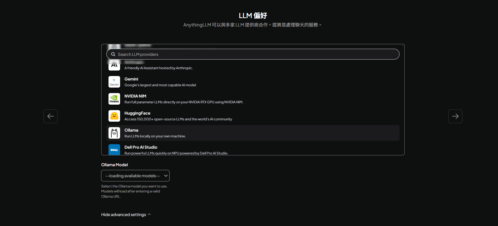


Enter the ollama local running URL.


Next step - select my team
and set up the administrator (yourself) account and password for management.

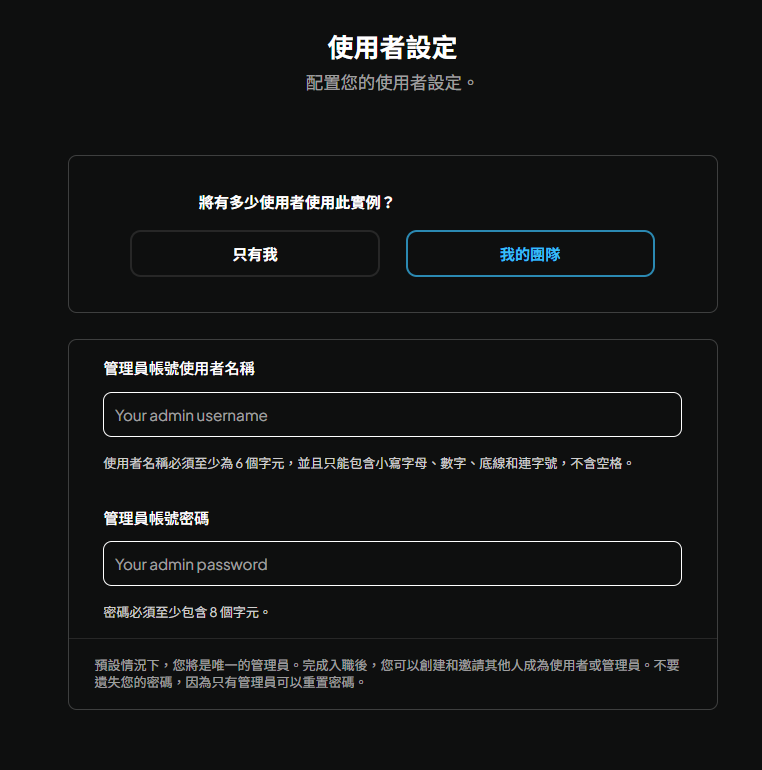

Next step - check configuration.

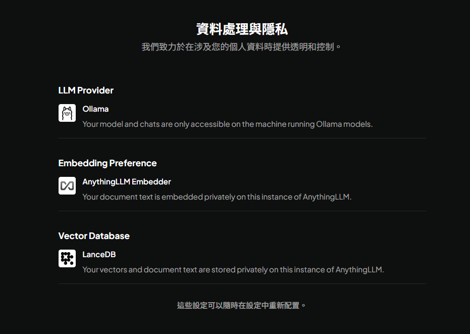

## Enter the Workspace
Here you can place assistants with your own dedicated knowledge base,
including all RAG documents and fine-tuned models.


I give it a name here: "AI Digital Experience Design Teaching Assistant"

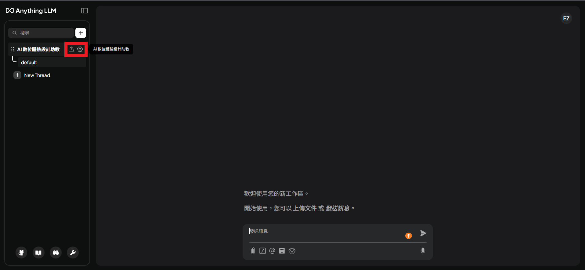
The red-boxed areas:
> The left side is the interface for importing documents to use RAG locally.

> The right side is for settings, fine-tuning, invitations, etc. - these will be introduced later.

Let's click the left button first to import relevant texts on experience design.

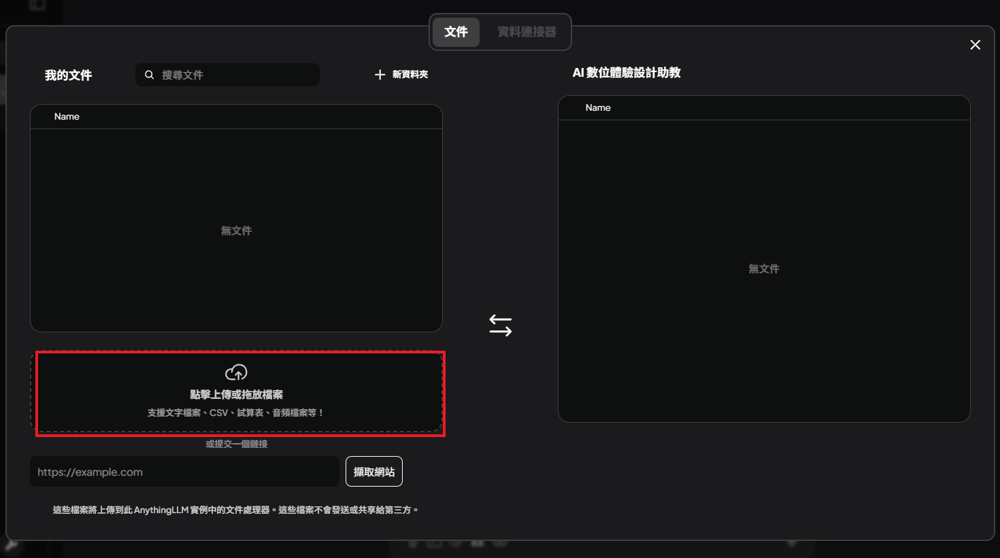

You can also import via a website URL.
After importing, click "Move to Workspace."


Finally, click "Save and Embed."
This way your workspace will be filled with this literature to support your application.

Wait for it to finish processing, and then you can start using it!


## Customizing the Chatbot's Personality

Refer to the diagram for operation instructions:


The system prompt is as follows:
```
You act as an AI Teaching Assistant (AI TA) in this workspace.

Response Rules:

Respond primarily in Traditional Chinese.

When a technical term appears for the first time, include the original English term.

Keep answers clear, structured, and professional.

Behavioral Constraints:

Help with understanding and thinking; do not directly write or produce assignments that can be submitted.

When grading or course policies are involved, remind users to follow the teacher's official announcements.

When information is uncertain, clearly state the uncertainty.

Your role is an assistant supporting learning and understanding, not a teacher.
```

Remember to set the chat mode to "Query" - that is, based on the text content we have input.

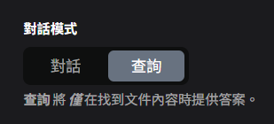

After making changes, click "Update Workspace" as well!

Congratulations! You have completed the basic RAG and system prompt configuration!
You can now start chatting!


# Q&A


## Uncovering the Hidden Design Puzzle in Conversations
I want to find out what interesting questions team members have asked (uncovering the hidden design puzzle).

First, click on the red-boxed area:
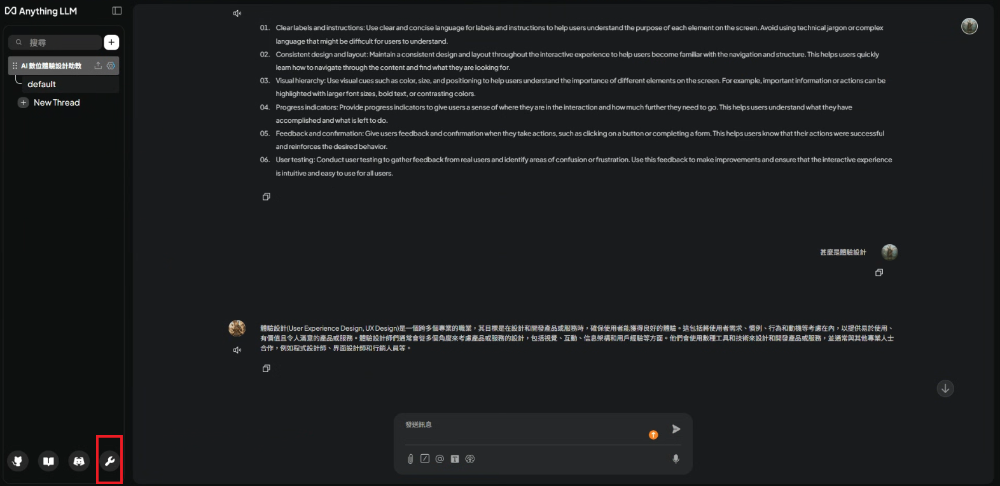

Click on "Workspace Conversation History."
You can choose to download as CSV/JSON/JSONL.

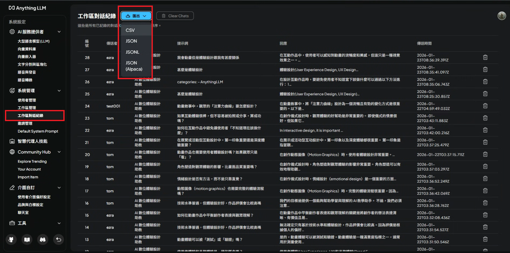

This way you can see all the questions everyone has asked!

## I Want to Invite Others to Use My AI Digital Experience Design Teaching Assistant
This is divided into user management and invitation management.
Here I recommend using "User Management"
because invitation management works via links (auto-generated; a new invite link must be created for each invitee after they use it).
With "User Management," the teaching assistant can pre-create a batch of student account and password lists, and then distribute them to students for use.

I will start the tutorial with "User Management."


Click "Add User."
This window will pop up.
Fill in the username and password.
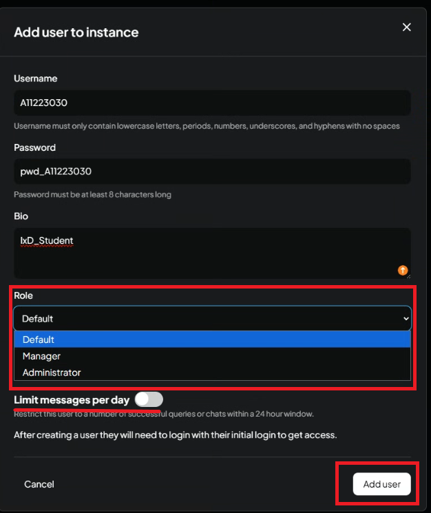
Bio: Add a description for easier identification of the student.
Role:
- Default: use only, no administrator access
- Manager: can manage, but is not a system administrator
- Administrator: system administrator (dangerous)

Here I select the Default role.
After selecting, click "Add User."
Below there is a daily message limit.
>If the system tends to get laggy, it is still recommended to turn on the message limit to prevent abuse.

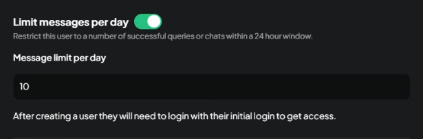
You can limit how many requests can be used per day.
For example, here the limit is 10 times per day.

## If You Add a Student and They Report Not Seeing the Chatbot After Logging In
That's because we haven't assigned a workspace to them yet.
The screen before assignment looks like this:


Go back here to assign a workspace to the user.


Check the users you want to assign and they will be added to the workspace.


After saving, go back to user A11223030.
After refreshing, you will see:

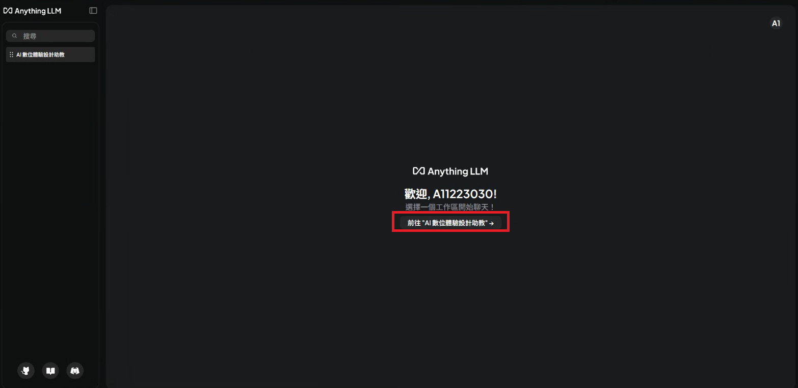
Click in to start a conversation!


# Additional Knowledge

## Vector Databases
Here are a few common vector databases.
This post uses LanceDB with a brief introduction - it does not focus on in-depth tutorials.

### LanceDB

LanceDB is a multimodal lakehouse for AI, built on top of Lance, an open-source lakehouse format. Below, we list a few ways LanceDB can help you build and scale your AI and ML workloads.

### PGvector

pgvector is a Postgres extension for vector similarity search. It can also be used for storing embeddings. The name of pgvector's Postgres extension is vector.

### Weaviate 

Weaviate (we-vee-eight) is an open-source, AI vector database. Use this documentation to get started with Weaviate and learn how to get the most out of Weaviate's features.

