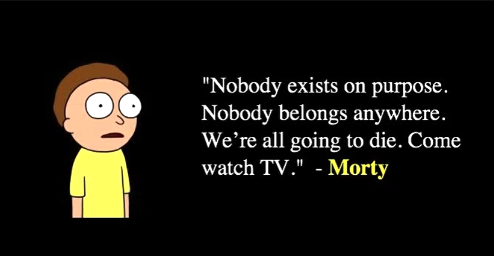
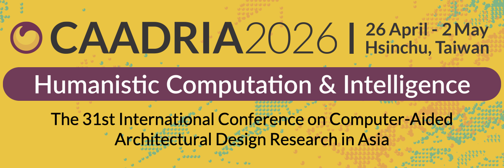

slug: prep-CAADRIA-2026
# When Discipline Becomes Routine: Preparing for CAADRIA Two Months Out, I Chose to Sync with the World

## Translation Is Not Enough

Preparatory study to reduce the cognitive gap.
Many people say, "Just use body language or a translation app to chat."
But having managed cross-national team collaboration before, I know that is far from enough.
Pronunciation, regional language isolation (different countries have different vocabulary preferences — even the same language can be incomprehensible), and beyond that, one-to-one translation wastes so much time.

Just to explain a Rick and Morty joke,
you have to ask the other person to hold on
while you finish translating before you can continue.
At its core, it is disrespectful toward the other person's culture.
The experience that hit me hardest was on a German team I worked with — there was an Indian team member.
Everyone else, all native-language speakers, understood his ideas just fine.
But I happened to be the leader he trusted most.

## I Need to Change

On top of intensive one-on-one tutoring,
my daily routine became:
Wake up — listen to English.
Before sleep — chat with random foreigners on an English Discord server.
I also met KP and Nyear, guys from a Thai medical school and a top science and engineering university.
We talked about all sorts of everyday topics — Thai military politics, songs, food, and more.
I even learned how to argue and confess feelings in English.
It was quite an interesting journey.

## My Filipino Teacher

My private English tutor is from the Philippines.
He specializes in debate and business English —
a perfect fit for me, since I love watching Rick in Rick and Morty talk circles around everyone:
fast delivery, endlessly entertaining.
At first I was really rusty — hadn't spoken much since September 2025 —
but now the words just come.
I also picked up a lot of American TV show references along the way.

Many people laughed at me for wasting time and money.
But to me, nothing is truly wasted.
Being alive means exploring everything you don't yet know.

## The Motivation

It started with this one simple reason that launched a two-month adventure:
a conference assistant role two months away.

