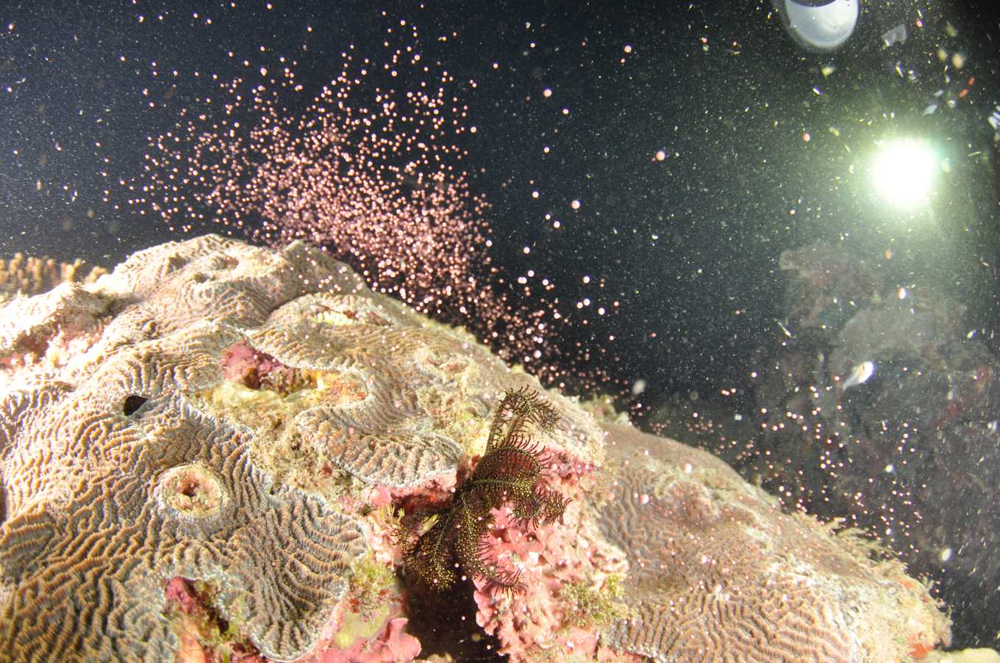

slug: stay-alive

# The Birth of Life
Once a year, pink coral
spawns on the weekend — 05.09.26.
Late at night, I saw this news in the group chat
and a thought suddenly came to me:

I want to go witness the birth of life,
because it is truly beautiful.

## If Money Allows and Time Allows — What Else Is Holding Me Back?

Memories and fantasies about the future —
nothing is stopping me.
It is all just my own imagination.
If I want to go, just go.

## Enjoy It — Right Now!
I always tell myself: enjoy it later.
But right now I already have everything worth enjoying:
my family, friends, hobbies, interests, teachers, and the design program.

So slow down, and just go when you want to go!

