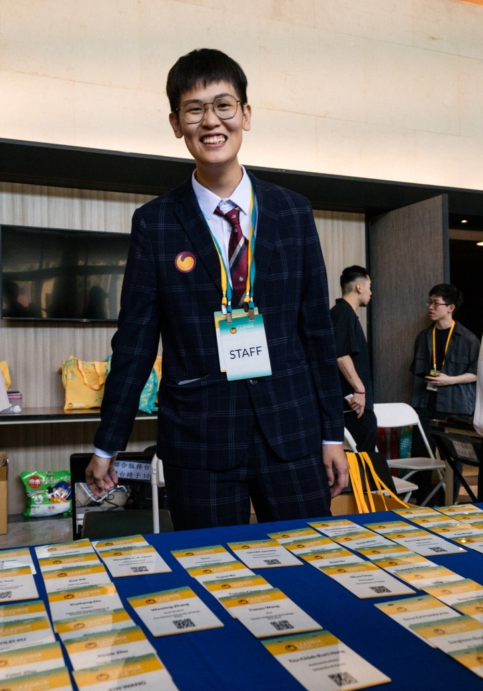

---
title: "YI-SHENG WU"
date: 2026-05-08
layout: "page"         # 強制指定使用「頁面」佈局

--- 

# 我是跨域人機互動（HCI）與多模態 AI 研究員 
具備資訊管理架構與數位媒體設計雙重背景，專注於 Multimodal AI、生理/語言多模態互動與端到端產品落地，同時擁有跨國協作視野與產品商業化思維。 
 

## 個人核心定位 
* **背景跨界**：資管架構 ✕ 數媒設計（NYUST IM &rarr; DMD，碩一 GPA: 4.0 / 二技 GPA: 3.8） 
* **核心技術**：Multimodal AI、生理與語言訊號融合、IoT 軟硬整合、雲端運算 
* **國際視野**：具備多語溝通能力（EN / DE / ES / TW），並活躍於國際工作營與全球學生開發者社群 
 

## 核心旗艦成果 
### 學術頂會發表 (IEEE MIPR 2026) 
* **Beyond Semantic Distance: Fusing Physiological and Linguistic Signals for Multimodal Coordination Assessment in Cross-Disciplinary Design** 
* 備註：碩一提早入學即發表於 IEEE 國際頂尖多媒體資訊處理會議（MIPR），結合生理訊號與語意訊號實現跨領域協作評估。 
 
### 端到端產品落地：盲童教學平台 (2024/09–2025/04) 
* 使用技術：RAG / AI / Azure / IoT 
* 備註：針對視障兒童教育痛點，實現結合硬體物聯網與生成式檢索增強技術（RAG）之端到端落地應用。 
 

## 專業研發與領導經驗 
### 核心研發與國際協作 
* **雲科大 互動運算研究室**：獎助研究生（2026/01–至今） 
* **CAADRIA 2026 國際工作營**：[Workshop Assistants](https://youtu.be/vL1OS1RpDgg?si=jU5B-O0uYo7ZrjEL)（2026） 
* **創科資訊 Trunk Studio**：軟體研發實習生（2023/01–2023/07） 
* **Microsoft**：學生大使（遠端，2025–2026） 
* **OPENHCI 人機互動工作坊**：[技術助教](https://www.facebook.com/openhci/photos/%E7%AC%AC%E4%B8%83%E7%B5%84%E5%AD%B8%E5%93%A1%E5%82%85%E6%94%BF%E6%96%87%E9%84%AD%E6%9A%90%E7%80%9A%E4%BD%95%E5%98%89%E7%91%9C%E8%A8%B1%E8%A9%A0%E5%A9%B7%E6%9D%8E%E8%AA%8C%E6%81%A9%E6%9E%97%E5%BA%AD%E6%85%A7ta%E8%B3%B4%E7%AB%B9%E5%8E%9F%E5%90%B3%E6%98%93%E9%99%9E%E6%AD%A4%E9%A1%8C%E7%9B%AE%E6%9C%9F%E5%BE%85%E5%9B%9E%E5%88%B0%E4%BA%BA%E8%88%87%E7%89%A9%E4%B9%8B%E9%96%93%E7%9A%84%E4%BA%92%E5%8B%95%E7%99%BC%E6%8E%98%E6%9B%B4%E5%A4%9A%E4%BD%BF%E7%94%A8%E4%BB%A5%E5%A4%96%E7%9A%84%E5%85%A7%E5%9C%A8%E5%8B%95%E6%A9%9F%E6%9C%AC%E6%AC%A1%E8%A8%AD%E8%A8%88%E6%83%B3%E8%A8%8E%E8%AB%96%E5%9C%A8%E9%81%A0%E8%B7%9D%E9%97%9C%E4%BF%82%E4%B8%AD%E7%89%A9%E4%BB%B6%E5%8F%AF%E4%BB%A5%E5%A6%82%E4%BD%95%E8%A7%B8%E7%99%BC/923086106288871/)（2024） 
 

<b>更多學術研究助理與跨域社群領導經歷（資安研究、學術志工、社群經營）</b>

 

> 具備橫跨硬體儀器、資訊安全至跨領域社群經營的團隊整合與溝通協調力： 
* **資安研發**：雲科大資訊安全研究室 - 獎助研究生（2024/09–2025/01） 
* **電機實習**：雲科精密儀器中心 - 兼任研究助理（2024/01–2024/08） 
* **學術志工**：2024 台灣人機互動研討會（TAICHI）志工（2024/07） 
* **技術推廣**：雲科 Google 開發者學生社群（GDSC）課程組（2023–2024） 
* **組織領導**：雲科元宇宙英語遊戲研究社 社長（2024–2025） 
* **社會實踐**：台中科技大學樂清志工 - [樂青服務績優獎](https://student.nutc.edu.tw/var/file/20/1020/img/873058548.pdf)（2018–2023） 

 

## 精選競賽與商業戰績 
### 創新創業與商業價值 
* 2024 雲林國際創新創業營隊：**第一名** 
* 2025 雲林國際創新創業營隊：**第三名** 
* 2024 技職盃黑客馬拉松：**最佳創造價值獎** 
 
### HCI 設計與演算法實力 
* 2024 OPENHCI：**最佳故事獎** 
* 2024 海峽兩岸青少年人工智慧大賽：**第三名** 
* 2022 CSF程速勁賽：**第三名** 
* 2022 中國上優技能獎學金：**特殊成就獎** 
 

<b>更多跨域黑客松與技術挑戰經歷（累積 8+ 場快速原型、雲端技術與教育科技實戰）</b>

 

> 實現高抗壓的極限開發能力（Rapid Prototyping）、軟硬整合與新興技術快速迭代優點：

* **雲端與架構**：2024 [中區雲端技能競賽](https://www.techadmi.edu.tw/schools_detail_search.php?psrid=102&seq=213) 佳作
* **創客與智慧生活**：2024 TCN 創客松 - 生活改善設計競賽（入圍）
* **智慧應用與運動科技**：2023 全國大專智慧應用競賽《椅動上籃》（入圍）
* **教育科技與互動設計**：2022 顯示科技怎麼用？我的課程我來定！（佳作）

## 專業證照與特質 
### 雲端、行銷與專業技術 
* **雲端架構**：AWS Certified Cloud Practitioner（2023） 
* **數據與行銷**：Google Analytics (GA4) 認證、Google 完整 AI 廣告與數位行銷認證體系（10 項廣告與 AI 認證，2024） 

<b>Google 完整數位行銷與 AI 廣告認證矩陣（10 項專業認證，具備商業變現與流量理解）</b>

 

> 具備將 AI 技術與實際商業廣告流量、素材生成及精準行銷對接之完整知識體系： 
* Google ADS 搜尋廣告認證（2024） 
* Google ADS 影片廣告認證（2024） 
* Google ADS 多媒體廣告認證（2024） 
* Google 廣告素材認證（2024） 
* Google AI 技術輔助高效認證（2024） 
* Google ADS 評估認證（2024） 
* Google AI 技術輔助購物廣告認證（2024） 
* Google ADS 應用廣告程式認證（2024） 
* Google 提高離線銷售量認證（2024） 

 

### 語言能力與個人風格 
* **語言**：中文（TW）、English（EN）、Deutsch（DE）、Español（ES） 
* **探索與生活**：PADI 進階開放水域潛水員（AOW，2026）、野溪溫泉、森林徒步、Espresso 萃取、植栽花草 