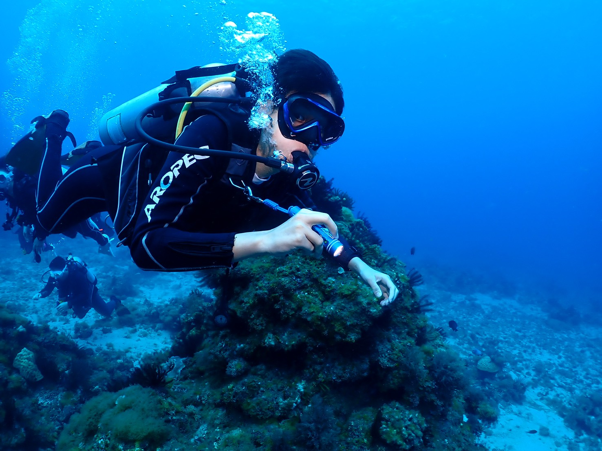
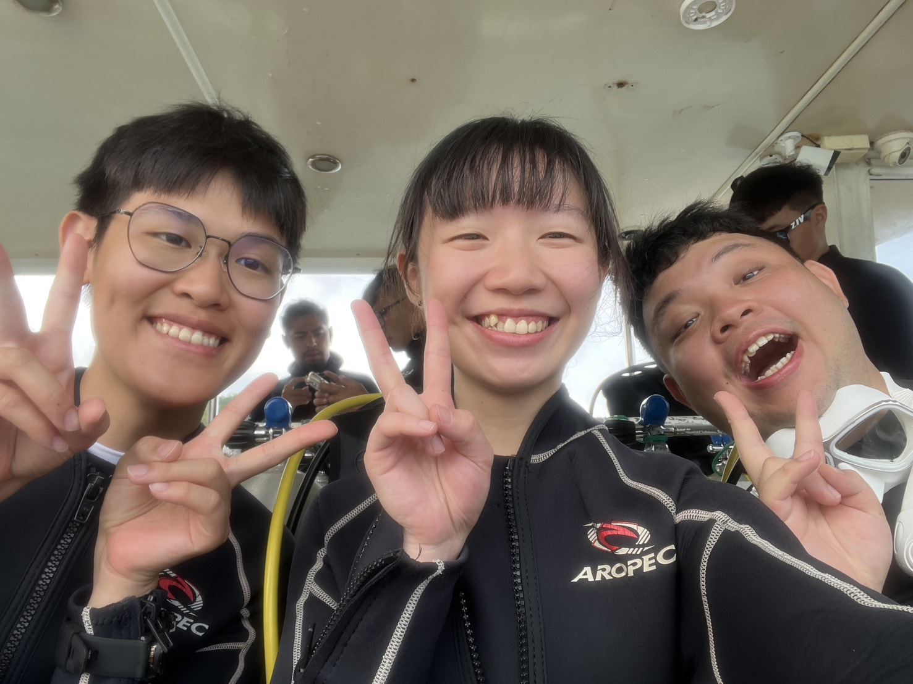
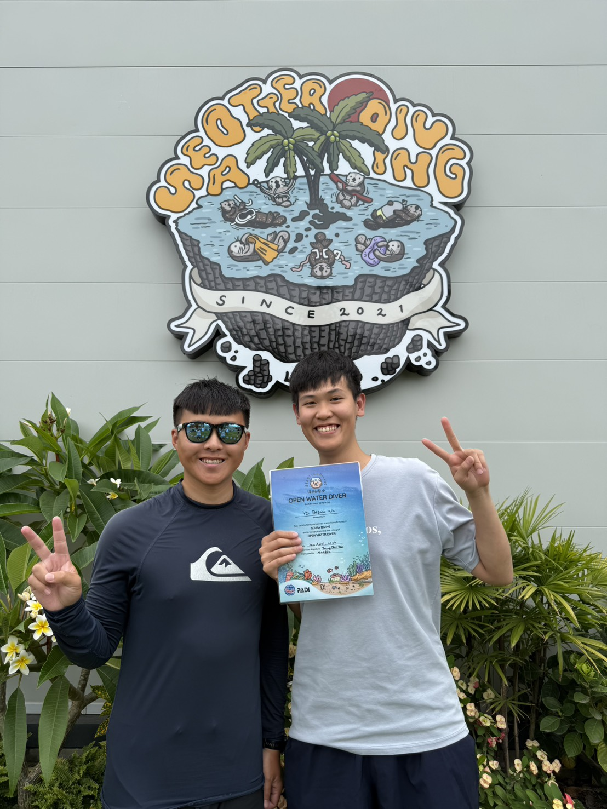

slug: 0421

#  體驗過寂靜黑暗的深海後，我意識到甚麼是生命的意義!

我在船潛前其實感受不到
我為何在這裡
我在這裡要幹些什麼
我為何要把自己困在雲科

但經歷過 周遭一切只有黑暗 微弱的手電筒光指引著深海 
而當下只感受到自己與夥伴的呼吸聲
一切的無意義
變得有了意義
呼吸 手勢 海水 光 大自然 魚兒 都是意義

活著本身就是個意義

## 熱愛自己 活在當下

回顧 我的夢想就是進入HCI領域
跟一群HCI專業的研究者
一起研究如何透過設計
找出問題
而非直線的找出答案

對ㄟ 我已經圓夢了
我現在就在我熱愛的科系中
第一次與我熱愛的科系面對面
而不是由命運幫我做選擇

我愛著雲林的空氣
充滿土壤及稻米的香氣 
騎著腳踏車的人們
及在我記憶中故事的事

曾經搞砸的社團
曾經陪我冒險的朋友

都在那裏

或許 當下 就是生命的意義

## 故事還得回到

2026年3/30號翹課去學潛水
一開始只是想體驗 甚麼是潛水
但潛水好貴喔
於是 我打算直接考PADI OW
所以我就直接行動出發到小琉球考證照了

我學了線上教材
也考了open water潛水員考試

後來遇到一位香港的朋友Franky
我主動詢問要不要夜遊
他很高興的接受我的請求

我們在路上遇到烏龜
救下烏龜

一起吃飯
簡單 平靜 也是生命的意義

## 進階潛水員考試

Franky 提到 AOW 可以看沈船及夜潛
大大勾起我的興趣
於是我手刀報名
1000美金 這是我花過最值得的投資
夜潛 我體驗到了
身處寂靜冰冷的海水
關上手電筒後
一切歸向虛無
揮動手臂 星星閃耀
原來那是磷蝦
原來這就是生命

## 我們被海流沖到2公里外的海洋

第一次船潛
原本要去看威尼斯沈船
但是在下降的途中
海流過大
教練叫我們放掉繩索
任由海流對我們處置
原來這就是大自然阿
敬畏 但不恐懼 我想透我的生命是甚麼了!
回到水面 打浮力帶
請船長回來接我們 才發現 大自然將我們帶離 2KM 遠的海洋

## 愛上體驗 活在當下

我很喜歡白日夢冒險王的金句:
‘To see the world, things dangerous to come to, to see behind walls, draw closer, to find each other and to feel. That is the purpose of life.’
開拓視野，突破萬難，看見世界，貼近彼此，感受生活，這就是生活的目的。
——⟪白日夢冒險王 The Secret Life of Walter Mitty⟫

現在開始 我想活在每一秒
不糾結過去
不焦慮未來
只為現在的感受買單

