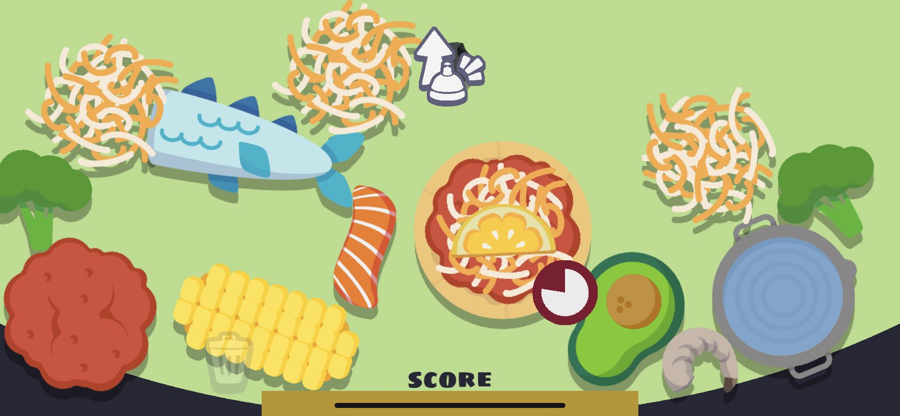
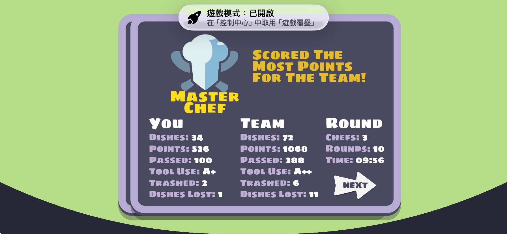
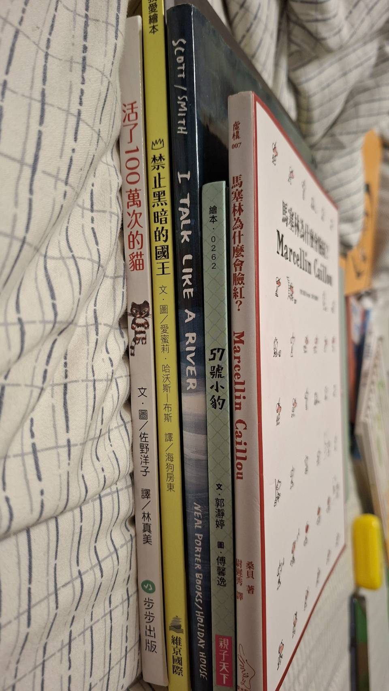

# 登場人物

1. 欣祐 是個醫生 
他很特別 每次都會講一段很震驚的暴論 像是宣告絕症的那刻一樣 驚艷我們 
他的個性很單純 使用翻蓋式手機 
在我得到發燒時 主動給我們大家自己帶的藥 非常暖心 

2. 湯先生  
每次都是開心果的那個  
我也學他說話一周  
有點像在他的角度想事情 
事情就輕鬆很多  

3. 宇鏞  
情感很細膩、愛書、愛知識、唱片店、未來的心輔師(他提到想用自己的專業幫助他人讓我想到以前的我)  
會帶繪本來給讀書會(醫生,我) 來看  

## 湯先生

湯先生突然提到要不要一起煮飯  
於是我和醫生便加入這個行列 
那時，我們打飯班班長這為值星週 
所以一周都要拉菜 
無聊之餘 
湯先生便提出這個請求 
我們來做飯吧! 

## 手機沒電

手機沒電的宇鏞(氣質男孩 懂很多知識) 
便提出要加入我們 
於是做飯即將開始 
過程中最令我印象深刻的是 
醫生的桌上堆滿了食物 

湯先生便伸手自己拿自己要的食材 
送餐 

## 宇鏞的繪本

1. 禁止黑暗的國王 - 群眾力量把一個不可怕的東西可怕化(盲從思維)
2. 馬賽琳為什麼會臉紅 - 友情 (像"再見機器人")
3. i talk like a river - 失語症的小孩
4. 57號小豹 - 學會欣賞自己的不同 (醫生說還不錯 但對他而言很難實現)
5. 活了100萬次的貓 (關於愛的故事 但我其實不太懂)

