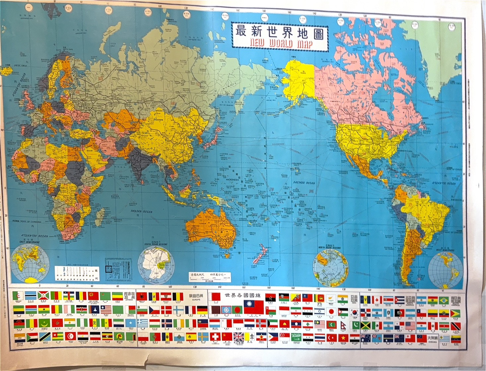

# 最新世界地圖
仔細一看 
並沒有新中國的標示 
只有中華民國並概括整個台灣、中國及蒙古 
只有西德沒有德國 

地圖右邊卻標示著民國74年8月出版 
一查，我發現這是冷戰及戒嚴時期頒布的世界地圖 
這張地圖從我出生就在了 
算一算有41歲了 

GPT說:
>只有中華民國，沒有新中國： 1985 年台灣仍處於戒嚴時期（1987 年才解嚴），政府受《水陸地圖審查條例》嚴格規範。當時法律規定大陸地區必須標為「中華民國」領土，劃分 35 省、保留秋海棠（含外蒙古），絕不允許標示「中華人民共和國」。 

> 沒有統一的德國，只有西德： 1985 年兩德尚未統一（統一發生在 1990 年）。當時台灣與資本主義陣營的「西德」（德意志聯邦共和國）往來，官方地圖上自然只有西德（或將東德視為共產控制區）。 
>這是一張非常珍貴且具歷史標誌性的冷戰末期正版老地圖，忠實記錄了 40 年前台灣官方的視角與當時的國際地緣政治格局。 

## 我的酷外公

那讓我想到我不就把這些三代人的記憶當成"日常" 
回看我的房間"書房" 
有著德國反戰思想、馬克思主義、世界地圖集、六法判決書  
還有當時象徵著權貴人家家中必備的醫療百科 
我想把這些記憶更好的保存起來 
並將這些記憶傳承下去 

我爸爸精通很多歷史 
我與他提到這張地圖的時候 
他說:當時戒嚴不能提到共產黨，所以這張地圖非常珍貴、難以取得(有被抓去關的風險) 
我便想像我阿公不就像是那種會召開地下讀書會的那種酷阿公嗎? 

另外，俄羅斯(蘇聯)看起來很大 
但與今天的俄羅斯也不太一樣了! 
裡面有些國家已經獨立 
也算是見證這40年世界的改變了吧! 
畢竟我才23歲，有個人意識到現在或許才10餘年而已 

> 中國及台灣那邊大片黃色是中華民國

## 地圖彩蛋 (AI+人工選出)

###  中國與鄰近邊界地圖的「秋海棠」政治彩蛋

「北平」而非「北京」：地圖上一律將北京標註為「北平」，並將「南京市」標註為中華民國法定首都，台北則註記為「中央政府所在地」或「臨時首都」。 
納入外蒙古與唐努烏梁海：地圖堅持完整「秋海棠」版圖，將外蒙古標註為「蒙古地方」（不承認其獨立，首都被標為庫倫而非烏蘭巴托），以及中亞的唐努烏梁海與帕米爾高原未定界。 

三十五省與「淪陷區」標註：維持抗戰勝利後的「三十五省、兩地方、一特區、十四院轄市」編制（如熱河省、察哈爾省、綏遠省、西康省、嫩江省等），並常在圖例或文字中將中國大陸標註為「共匪竊據區」或「淪陷區」。 

###  世界地圖與國際陣營的冷戰彩蛋

* 波羅的海三國獨立地位：愛沙尼亞、拉脫維亞、立陶宛在蘇聯統治期間，中華民國地圖長年仍將其獨立繪出，並加註「蘇聯非法佔領」。 
分裂國家的正統標記： 
* 朝鮮半島：將大韓民國視為唯一合法代表，北邊有時直接標為共匪佔領區或加註休戰線。 
* 東西德：德國標註為「西德（聯邦德國）」與「東德（蘇佔區）」，反映西方自由陣營的立場。 
* 高棉共和國 vs 柬埔寨：中南半島政權更迭頻繁，地圖會依據當時的外交承認，精準保留「高棉共和國」（朗諾政權）或錫蘭（斯里蘭卡舊稱）等舊稱。 

### 小島後會有標誌所屬國家

例如:
1. 美國戰略與託管島嶼（標註「美」或「美託」） 

* 琉球群島（美 / 美國託管）：1972 年沖繩返還日本之前，台灣地圖上的琉球群島（包含沖繩本島、宮古、八重山）常被標註為「（美）」或「美國民政府管轄」，甚至有些版本將其視為地位未定或維持歷史上的琉球概念。 
* 密克羅尼西亞諸島（美託）：包含塞班島、關島（美）、馬紹爾群島（美託）、加羅林群島（美託）、帛琉（美託）、比基尼環礁（美）等。太平洋戰略島嶼在二戰後由聯合國交由美國託管，直到 1980–1990 年代才陸續獨立或建立自由聯合協定。 
* 中途島、威克島、強斯頓環礁、美屬薩摩亞（美）：太平洋跨洋航線與冷戰前線哨站，一律清晰標明「（美）」。 

2. 英國非殖民化過渡期島嶼（標註「英」） 

* 香港、九龍（英）：標註為「英領」或「（英）」，新界常加註租借期限。 
* 聖誕島、科科斯群島（英 / 後轉澳）：印度洋上的島嶼，早期標「（英）」，後隨管轄權轉移標為「（澳）」。 
* 迪亞哥加西亞島（英）：英屬印度洋領地（BIOT），冷戰中期美英合作建立巨型海空軍基地，地圖常標為「查戈斯群島（英）」。 
* 福克蘭群島（英）：南大西洋戰略要地，堅決標為「（英）」，不採用阿根廷的「馬爾維納斯群島」稱呼。 
* 索羅門群島、斐濟、吉里巴斯（英）：在 1970 年代相繼獨立前，均標註為「（英）」。 

3. 法國海外屬地與核試驗場（標註「法」） 

* 大溪地 / 法屬玻里尼西亞（法）：包含進行多次核試驗的「莫魯羅阿環礁（法）」。 
* 新喀里多尼亞（法）：西南太平洋的法國海外屬地。 
* 留尼旺島、馬約特島（法）：印度洋西側的重要島嶼。 

4. 特殊共產陣營與冷戰對抗島嶼 

* 庫頁島（薩哈林島）南半部與千島群島（蘇 / 蘇佔）：依中華民國官方立場，不承認二戰後蘇聯對南庫頁島與千島群島（北方四島）的主權兼併，地圖常標為「蘇聯佔領」或加註界線未定。 
* 青年島 / 松樹島（古巴）：加勒比海冷戰前線，常標註為「古巴（共）」。 

5. 其他主權過渡標記 

* 西屬撒哈拉沿岸與加那利群島（西） 
* 葡屬帝汶（東帝汶前身）（葡） 與 澳門（葡） 
* 格陵蘭（丹） 與 法羅群島（丹） 

### 已消失的國家與政權
一、 解體與分裂消失的國家
這類國家因冷戰結束、地緣政治劇變或民族衝突，分裂成多個全新獨立的國家： 

#### 蘇維埃社會主義共和國聯盟（蘇聯 / USSR） 
* 存在時間：1922 – 1991 年 
* 消失原因：1991 年 12 月 26 日蘇聯最高蘇維埃正式宣布解體。 
現今演變（分裂為 15 國）： 

1. 東歐：俄羅斯、烏克蘭、白俄羅斯、摩爾多瓦 
2. 波羅的海三國：愛沙尼亞、拉脫維亞、立陶宛 
3. 高加索地區：喬治亞、亞美尼亞、亞塞拜然 
4. 中亞五國：哈薩克、烏茲別克、土庫曼、吉爾吉斯、塔吉克 

#### 南斯拉夫社會主義聯邦共和國（南斯拉夫 / Yugoslavia）
* 存在時間：1945 – 1992 年（1918 年建立前身為南斯拉夫王國） 
* 消失原因：1990 年代初爆發南斯拉夫內戰，各加盟共和國相繼宣布獨立解體。 
現今演變（分裂為 7 國 / 實體）： 
斯洛維尼亞、克羅埃西亞、波士尼亞與赫塞哥維納、北馬其頓（原馬其頓）、塞爾維亞、蒙特內哥羅（黑山）、科索沃（部分承認） 

3. 捷克斯洛伐克聯邦共和國（Czechoslovakia）
* 存在時間：1918 – 1992 年 
* 消失原因：1993 年 1 月 1 日經由和平談判達成「天鵝絨分離」（Velvet Divorce）。 
現今演變：和平拆分為 捷克共和國 與 斯洛伐克共和國。 

4. 塞爾維亞與蒙特內哥羅（塞蒙聯邦 / 前南聯盟）
* 存在時間：1992 – 2006 年 
* 消失原因：南斯拉夫解體後由塞爾維亞與蒙特內哥羅組成的殘存聯邦，2006 年蒙特內哥羅通過公投獨立。 
現今演變：分為 塞爾維亞 與 蒙特內哥羅。 

### 國名全面變更的國家
國土主權延續，但因去殖民化、政權轉移或語言規範，舊國名在地圖上完全除名： 
1. 薩伊共和國（Zaire, 1971 – 1997） 
蒙博托軍事強人統治時期的名稱，1997 年政權被推翻後，改回 剛果民主共和國（DRC）。 
2. 緬甸舊稱（Burma, 1989 年前） 
1989 年軍政府將英文國名由 Burma 正式改為 Myanmar。 
3. 史瓦濟蘭（Swaziland, 2018 年前） 
2018 年為去除殖民色彩並避免與瑞士（Switzerland）混淆，國王宣布正名為 史瓦帝尼（Eswatini）。 
4. 馬其頓共和國（Republic of Macedonia, 2019 年前） 
為解決與希臘長達近 30 年的國名爭端，2019 年依《普雷斯帕協議》正式改為 北馬其頓共和國（North Macedonia）。 
5. 土耳其英文國名（Turkey, 2022 年前） 
2022 年聯合國正式批准將其官方英文國名由 Turkey 更改為土耳其語拼法的 Türkiye。 

### 1980 年代地圖常見的特殊廢除實體
在 1980 年代的地圖上常被單獨列出，但隨冷戰與特定政治體制瓦解而廢除： 
南非黑人家園（班圖斯坦，Bantustans） 
代表政體：特蘭斯凱（Transkei）、波布那（Bophuthatswana）、文達（Venda）、西斯凱（Ciskei）。 
消失過程：1994 年南非終結種族隔離政策，這 4 個名義上「獨立」的名目國全數廢除，完整併回 南非。 
