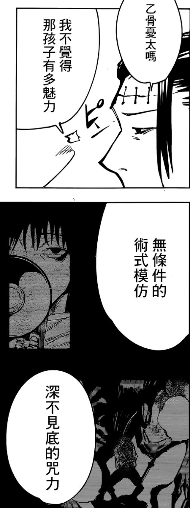

今天看了wiwi的blog提到的[主場優勢](https://wiwi.blog/blog/home-court)
引用自wiwi的主場優勢
>沒必要的話，別去客場打勝率低的球賽。
* 工作：選擇自己效率最高、發揮最好的工作環境。
* 社交：主動組織聚會，邀請你想認識的人來；在這個場合你就處於主導地位了。
* 商業談判：在自己的辦公室、熟悉的場地、用熟悉的方式進行重要會談；這樣你可以更好地控制環境跟節奏。

我想到我教授一直提醒我的 
要找到自己的主場 
而非一直在他人的客場比賽 
定義自己的規則，按照我的規則來玩 
教授說他年輕時，發表自己的design puzzle理論 
沒人看得懂他在寫甚麼 
而到今天我看了覺得很受教 
有一陣子25年的時候 
我很懊惱為什麼我每次去比賽都只能拿第三名 
而教授一直說你要找到自己的獨特性 
習慣於模仿術式的我當然不知道是甚麼意思 

例如我以前想做的互動 
講白就是拿其他教授的想法小改 
而非自己的想法 
做不出原創、創新 

在後來式一直討厭教授的狀況下 
嘗試、嘗試、嘗試 
還有多跟教授聊聊吧! 

最近，他說: 
>你們每一個人都是不同的特性 都是很棒的 只是都要非常花時間去體諒你們 
在我在逃避並突破自己成長時 他說這不能是理由啦 
>是要在這裡找到什麼特殊的地方 繼續自己的旅程
>在互動設計部分 這有哪點是別人沒做過的事

幹，這個教授超棒 
果然我沒選錯 
繼續待在雲科 
有點像是被接住的感覺吧 
當時創業後一直開心不起來 
也放棄原本的創業項目 
覺得自己很沒用 
被這個人強迫推一把! 

26年當兵認識宇鏞 
才意識到我有嚴重的防禦式社交 
難以讓人接話下去 
同時 
也變成難以卸下防禦好好玩的人了 
自然創新也別談 
但我走出來了 
這兩個月的當兵 
有點像經歷的我是主角的冒險 
有相遇、衝突、和解等等 

最後，我買了5套繪本給即將退伍的自己 
1. 男孩、鼴鼠、狐狸與馬 - 給在低谷的人一記擁抱。
2. 住在我心裡的怪物 - 情緒
3. 《在黑暗的日子裡，陪伴是最溫暖的曙光》- 一對大小旅伴，以天地為教室的人生體悟，在你心累時，給你最剛好的安慰。
4. 《在迷失的日子裡，走一步也勝過原地踏步》- 　　在生活中跌跌撞撞的每一道裂縫，正是光線得以照進來的地方。
5. 《有你的地方就是家》 - 　　今天能看見昨天仍視而不見的美麗，就是一種莫大成就。

>繪本有種奇怪的治癒力量

