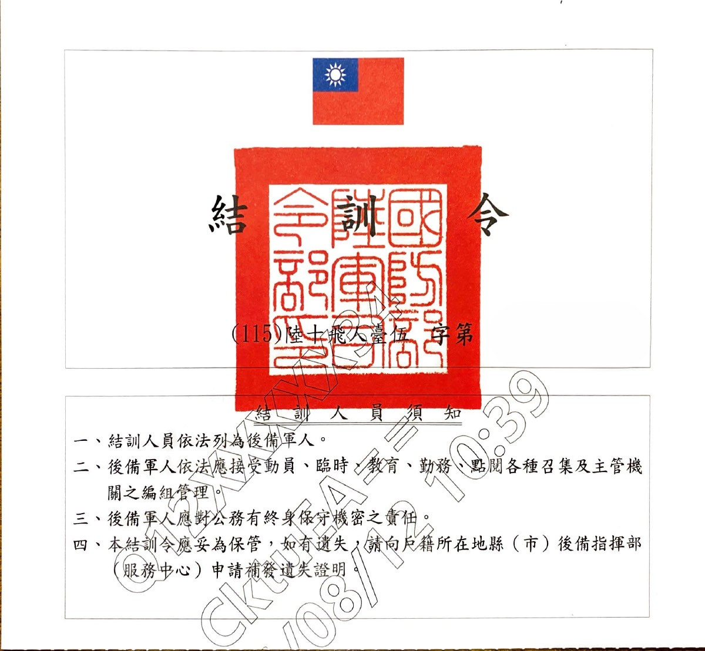
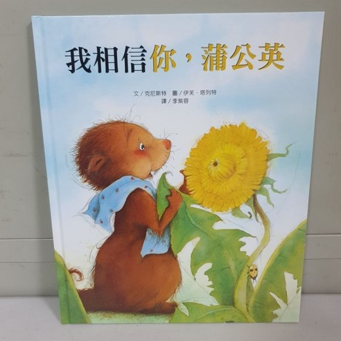
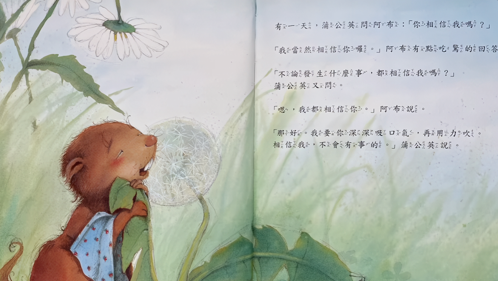
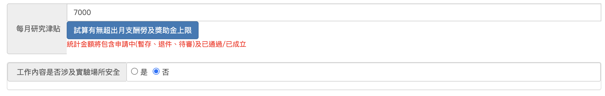

---
slug:
copyright: true
title: "結訓令"
date: 2026-08-27
updated:
tags: 
- 當兵記憶 
- 自我原諒
categories:
  - Life
---

# The End

四個月 
我想好好謝謝二階段遇到的一個鄰兵-宇鏞 
這兩個月更像是自我和解 
在聊天過程中 
慢慢把心房打開的過程 

而今天終於拿到結訓令了 
心情只有平靜 就這樣就結束了 
與當時第一次投研討會的我一樣心態 
就是又完成一個人生的里程碑 
雖然回顧軍旅生活 
被霸凌、性騷擾的噁心回憶還在我心中 
連長室也去了好幾次! 
但這些日子 
有宇鏞與"醫生"的陪伴 好很多 

最後一周 

宇鏞帶了蒲公英繪本 
我還記得我請宇鏞陪我演的一段戲 
蒲公英(宇鏞): 相信我 一切都會沒事的 
土撥鼠阿布(我): 我相信你未來會變好 
即便我有好多事情想與你分享 我也會相信你的 

這段劇情對我而言算是離別軍旅的一個很好的ending! 
四個月對我而言: 認識->被霸凌->被性騷擾->認識好友->結局 
不是很平的路 
但我也很勇敢的一直上報 
雖然也被白癡臨兵嗆我只會上報，如果是他 會容忍 
但我也想到 
或是就是我懂得反抗 
才能認識這些有個性的朋友 
成為社會的非主流菁英吧! 

以下記錄小回憶 趁我還沒忘記 
> DR(欣祐): 你們DPP... 
> 宇鏞: 你們醫生TPP... 
> M: 我是Middel election! 
> 我們是最愛聊政治的 最吵 最認真一起清臭臭蒼蠅的三個好友(H:同性戀救台灣!!!)  
> 一起聊歷史、兩岸、世界史、白恐228等

## 新挑戰

才剛退伍 
邊收到教授來找我當助教 
並預支7000給我 
又是新挑戰了 

非常期待! 那就是另一篇故事了! 
祝福欣祐、宇鏞有個燦爛的未來及人生! 
謝謝我的讀書會好友及照顧過我的長官們! 
(謝幕!!!) 

