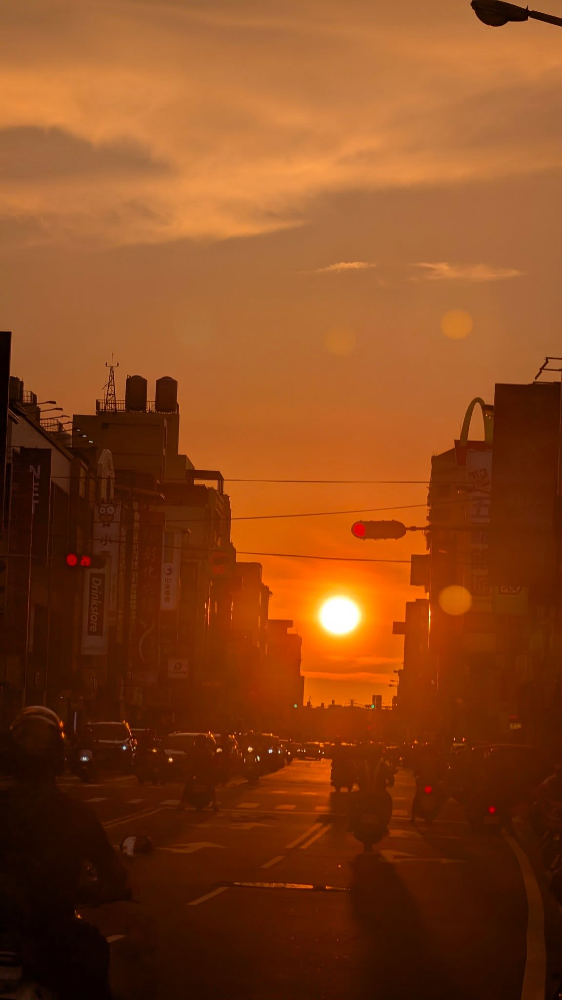

---
slug:
copyright: true
title: "啊那座山 是我們出生的故鄉"
date: 2026-08-27
updated:
tags: 
- 文化欣賞
- 台灣原住民文化
categories:
  - Life
---

# 彰化的傍晚

我就在想我總是想學點國際的東西 
因為害怕未來 
所以要逃離台灣 
但仔細看看周遭 
正是我愛的土地 

看看天空和街景 
好美也是我熟悉的日常 
有時會想往外抓別的東西 
但我們自己的本土文化如果都遺忘了 
就沒有人真正記得了! 
> 可可夜總會中的一句經典臺詞: 「真正的死亡是世界上，再沒有一個人記得你。」

## 欣賞原住民音樂
正確而言是流行樂非主流 
每個都讓我流淚 

### 原住民的孩子
<iframe width="560" height="315" src="https://www.youtube.com/embed/Fs2_xKdTjGs?si=wMIVDRC2qEhjmSOU" title="YouTube video player" frameborder="0" allow="accelerometer; autoplay; clipboard-write; encrypted-media; gyroscope; picture-in-picture; web-share" referrerpolicy="strict-origin-when-cross-origin" allowfullscreen></iframe>

### 不要放棄Aka pisawad (阿美族語版)

<iframe width="560" height="315" src="https://www.youtube.com/embed/gzuEvkk-eg8?si=sN7oXZw8cCLM2Lil" title="YouTube video player" frameborder="0" allow="accelerometer; autoplay; clipboard-write; encrypted-media; gyroscope; picture-in-picture; web-share" referrerpolicy="strict-origin-when-cross-origin" allowfullscreen></iframe>

### 基姜 Kincyang｜Rmngaw 說 
<iframe width="560" height="315" src="https://www.youtube.com/embed/iiUdkHNJshA?si=_QjWN2Log7WLRN0s" title="YouTube video player" frameborder="0" allow="accelerometer; autoplay; clipboard-write; encrypted-media; gyroscope; picture-in-picture; web-share" referrerpolicy="strict-origin-when-cross-origin" allowfullscreen></iframe>

### Mona - 山上的孩子 (Official Music Video)
<iframe width="560" height="315" src="https://www.youtube.com/embed/GfTL6E-pfGA?si=HwqwB7QrBIJMIKg0" title="YouTube video player" frameborder="0" allow="accelerometer; autoplay; clipboard-write; encrypted-media; gyroscope; picture-in-picture; web-share" referrerpolicy="strict-origin-when-cross-origin" allowfullscreen></iframe>

### 泰度向前
<iframe width="560" height="315" src="https://www.youtube.com/embed/8PDKx403IgA?si=c1cAAH8M6fDNgaP1" title="YouTube video player" frameborder="0" allow="accelerometer; autoplay; clipboard-write; encrypted-media; gyroscope; picture-in-picture; web-share" referrerpolicy="strict-origin-when-cross-origin" allowfullscreen></iframe>

### ABAO阿爆【Thank You】
<iframe width="560" height="315" src="https://www.youtube.com/embed/4cAp_IdqOuM?si=VQbcvEC6m_lzyGuf" title="YouTube video player" frameborder="0" allow="accelerometer; autoplay; clipboard-write; encrypted-media; gyroscope; picture-in-picture; web-share" referrerpolicy="strict-origin-when-cross-origin" allowfullscreen></iframe>

## 我想去啊那座山

這其實是蠟筆小新的台詞 
快開學了 
我想盡情探索原民文化 
於是我再次開啟我的環島計畫 

* 金崙部落
* 都歷部落
* 鸞山部落（森林博物館）
https://share.google/bqxKMvrP443xFVVes

