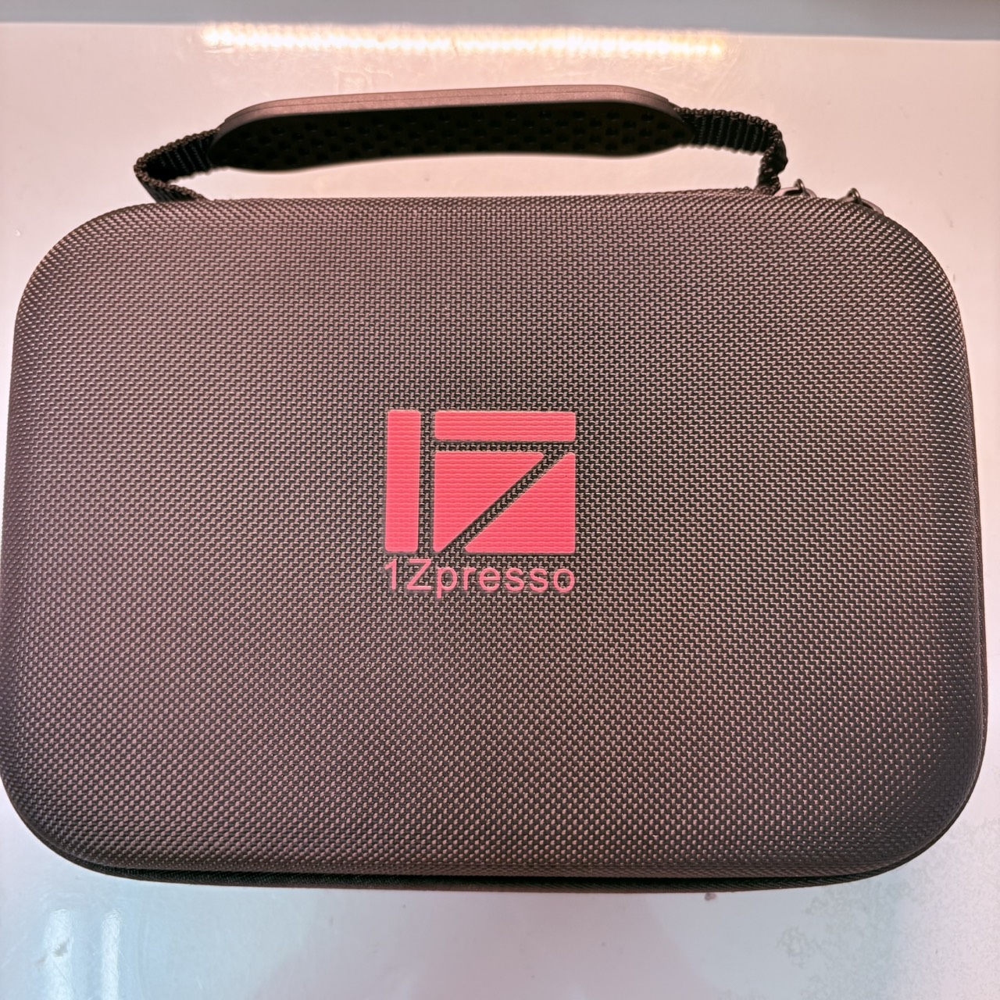
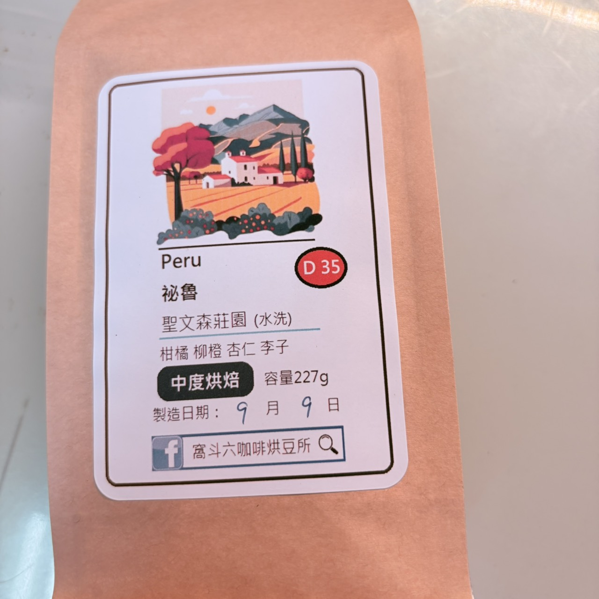
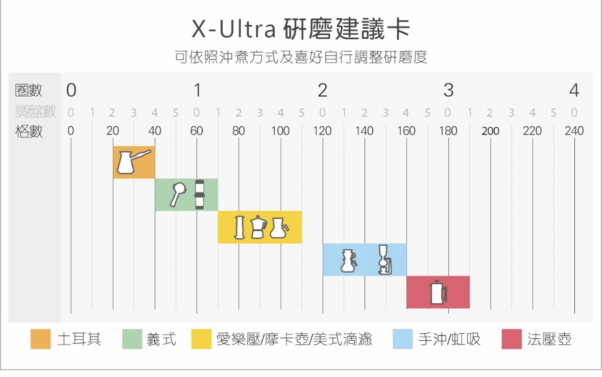
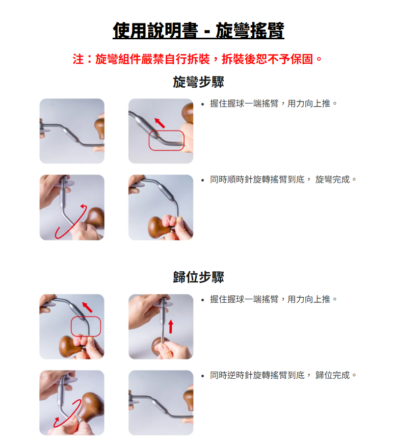

---
slug:
copyright: true
title: "開箱人生第一台手搖磨豆機"
date: 2026-09-10
updated:
tags: 

categories:
  - Life
---
# 新玩具開箱

精緻的外箱 
 

1zpresso xultra 
用我當兵退伍的少少薪水買喜歡的東西 
就真的超爽 

## 新口味-祕魯(水洗中焙)

以義式摩卡壺 
我覺得蠻重口味的可可感 
或許是因為還沒找到豆子的甜蜜點 
喝起來略酸 
>第一次自己手磨 房間都是咖啡香

官方建議表:

## 《新手最常發問的三個刻度問題》- 來自1zpresso 官方

1.請問磨豆機每次研磨完咖啡豆後，都需要歸零嗎？ 
以內調式（Q2/KS/JE)與 
上調式（Jepro/Jeplus)來說 

### 『歸零』 
是要調整刻度時才需要做的動作 
一但調整到喜愛的刻度 
磨豆機並不需要每次都做歸零 

### 那什麼時候需要做歸零呢？
由於內調式/上調式的刻度盤數字 
與粗細沒有關聯， 
所以當你遺忘現在的刻度是多少時， 
才有需要在再次執行重新調整。 

如果只是單純微調粗細， 
也不需要做歸零， 
希望顆粒粗一點， 
就逆時針轉動調扣， 
希望顆粒細一點， 
順時針調整調扣即可。 

### 直調（EPRO/KPRO/KMAX/KPLUS)
由於刻度顯示上較為直覺 
就算遺忘了磨豆機的粗細， 
也可以透過調節環上的數字辨別， 
因此調整粗細上， 
沒有歸零的需求， 
調整時直接按照數字上的顯示 
做判斷即可，數字越大則是越粗，越少越細。 

『直調式唯一需要歸零的狀態， 
只有徹底將內刀卸下時， 
才有需要再做重新歸零的動作。』 

歸零標準由於每次的力道很難一致， 
故歸零的判斷方式，可放上搖臂後， 
不會大幅度晃動即可 

＊＊不需要將刀盤鎖到一動也不動＊＊ 

2.磨豆機歸零時，調扣上的標示點， 
指到數字不是零是正常的嗎？ 
以內調式來說， 
由於刻度盤上的數字 
只是幫助 
記憶歸零點的位置， 
所以對到的位置 
不一定會是0這個位置。 

以直調式來說， 
當徹底拆解組裝完後， 
歸零的標準只要搖臂無法 
大幅度晃動即可， 
而非完全鎖到底， 
讓搖臂一動也不動， 

因為調節方式相對省力， 
每次力道無法達到統一， 
所以轉緊時會有幾格的差異 
是正常的喔 

3.請問A款磨豆機刻度兩圈，對應Ｂ款磨豆機刻度是多少？ 

由於刀形設計 
與調節方式不同， 
即便下降的高度相同， 
研磨的粗細也不會完全一樣， 
如不清楚適用的刻度， 
可以參考建議刻度表 ， 
不過建議刻度表 
主要是減少刻度摸索的時間， 
也沒有一定只能用 
建議刻度上的範圍， 
不要被建議範圍給限制喔。 

## 放送事故
差點剛拿到就把把手弄壞
這個要往內推
才能往上

