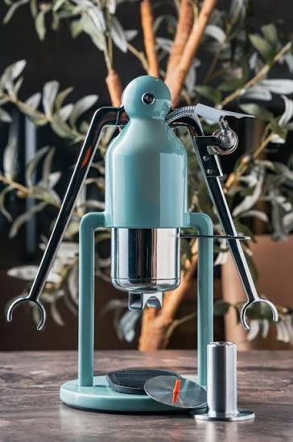
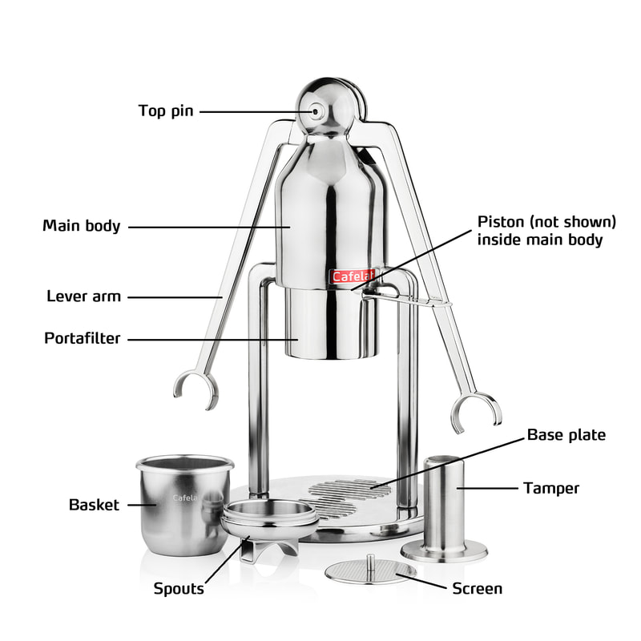

---
slug:
copyright: true
title: "!菁英之路=平凡之路"
date: 2026-09-10
updated:
tags: 
- Espresso
categories:
  - Life
---
# 聊一下心情好了
今天在帶TA課時 
遇到以前的教授們 
還有現任的教授 
我知道我的那些成就是真的 
但對我而言是一種負擔 
因為我必須一直衝 不能停下來  

教授A:
- 他現在是我的學生 
- 以前有開公司、對新創有了解 
- 他上過我一年的創客課程、學德語習慣 
- 得獎無數、是菁英班的學生 
- 碩一提早入學就投稿IEEE 

教授B:
- 他以前是我的學生 
- 他是他們那屆最優秀得獎最多的學生 
- 他曾是我們精密儀器中心的兼任研究助理 

我很謝謝教授們給我的鼓勵 
- 但從我讓自己學會放鬆後 
- 這些鼓勵又提醒著我 
"你還不夠好! 你不能停下來 你要健身" 
- 你只是以前厲害 現在不厲害 
- 你的身形比例很怪 不像CEO 
- 你的缺點要藏起來 

(我有好點 至少我現在可把負面情緒控制一個水平)

但我確實還有成長的空間 
> 兩年前的社交圈 我只要稍微提到我的負擔 大部分的朋友都會覺得 你這麼成功 抱怨個什麼?

<iframe width="560" height="315" src="https://www.youtube.com/embed/ecTSlaNM0Z0?si=JpTgfk_TW8asQoPz" title="YouTube video player" frameborder="0" allow="accelerometer; autoplay; clipboard-write; encrypted-media; gyroscope; picture-in-picture; web-share" referrerpolicy="strict-origin-when-cross-origin" allowfullscreen></iframe>

# 學到演講精隨
在怎麼無聊的簡報 
都可以講的像故事ㄧ樣有趣是我今天學到的事情 
規劃要考慮教授們的狀況/學生狀況/交通狀況 

# Cafelat Robot 

主要喜歡它的顏值 
聽說榨出的crema也很厲害 
屬於義式玩家的浪漫 

我這周每天幻想 
有了它會生活多美好 
但是我還是有再用我現役的 
Bialetti's moka pot 

構造簡單 
聽說這個也能把我 
1Zpresso's xultra 潛力發揮出來 
我非常期待呢 
售價也只要 
USD.xxx!!! 

!更新 2026.09.11 
我真的買了!!! 
超期待到貨 
我買的是藍色的 
雖然以前就用獎學金買 
Bialetti的moka pot 
BUT!!!! 
這次是 
Cafelet robot !!!! 
好興奮 

