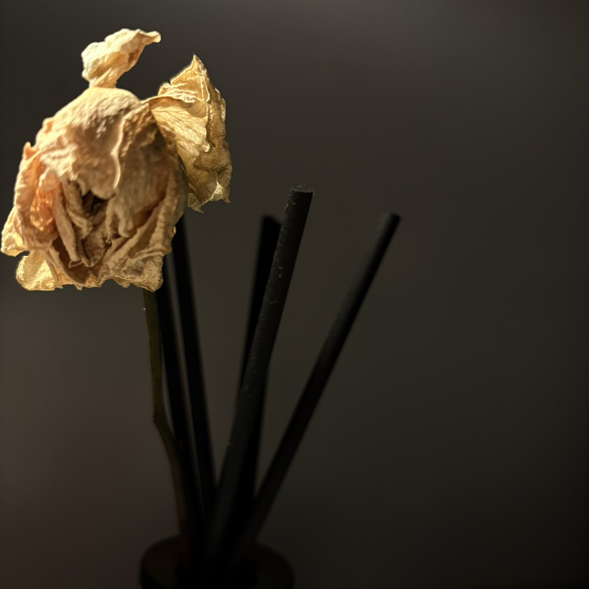
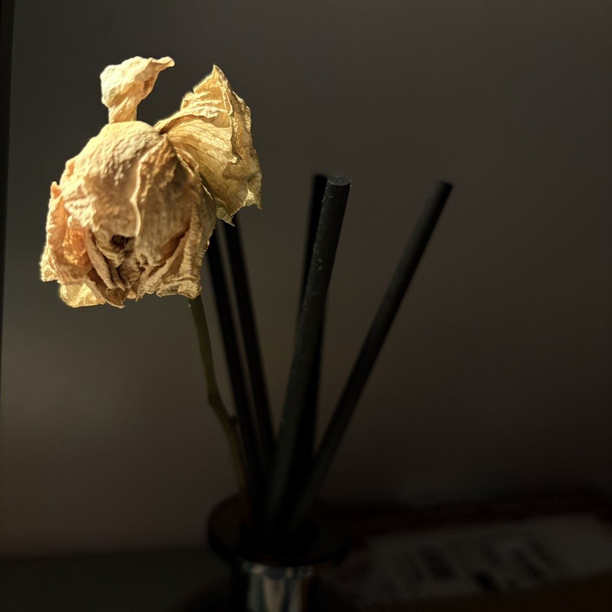

---
slug:
copyright: true
title: "凋零也很好看!"
date: 2026-09-17
updated:
tags: 
- self improvement
categories:
  - Life
---

23:01 Ezra 死的很好看呢  
22:58 Ezra 好想潛水阿(人生要是能一直逃避能多好?) 
22:58 Ezra 好想去很多地方玩 然後去喝濃縮 
22:59 Ezra 然後 邊走路累的時候直接躺在路邊發呆 
23:01 Ezra 想買很多花 看他從綻放到凋零 再到被酒精香水 
23:03 Ezra 我也想去柔道社 徹底的肉體改造 
23:03 Ezra 把自己整個拉起來 
23:03 Ezra 用盡全力 我也曾經站在舞台中眺往著觀眾們 
23:03 Ezra 德語也好 西班牙語也好 這就是我認識世界的方式吧! 
23:05 選修第二外語的高中生 :: 曾經也是熱情被澆灌後繼續熱愛西文的自己 
23:05 國科會 創業計畫什麼的 興奮也麻煩 
23:05 Ezra 好想創造一個自己與自己聊天!@  

