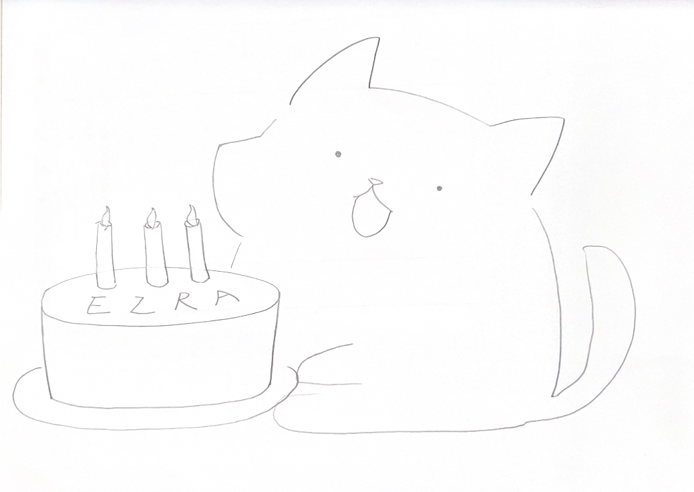
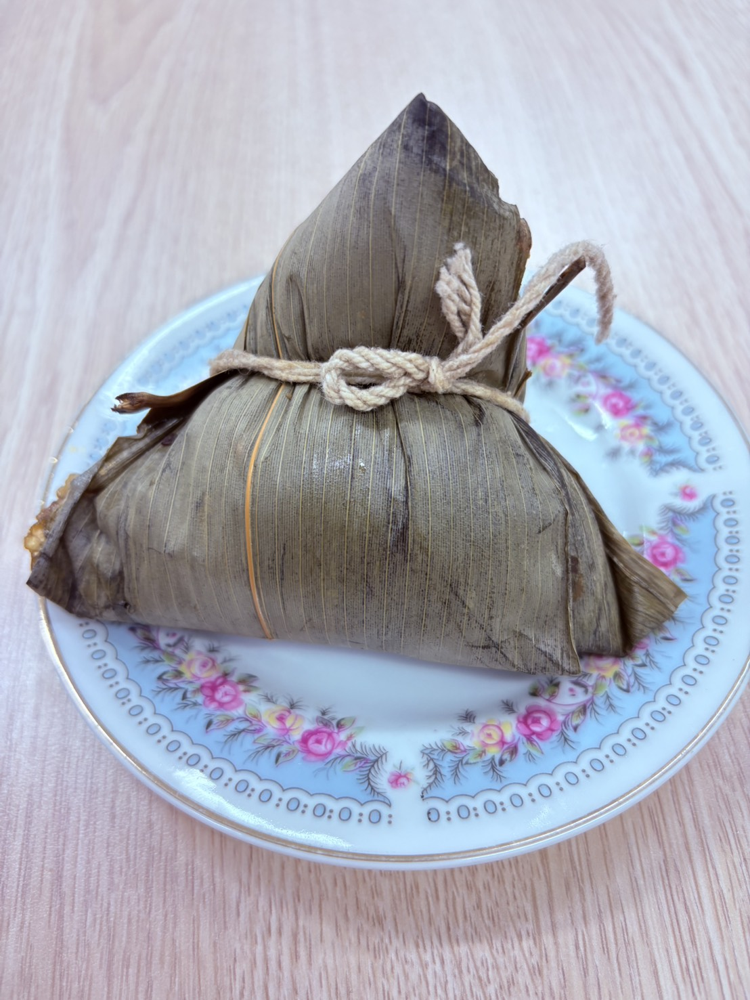
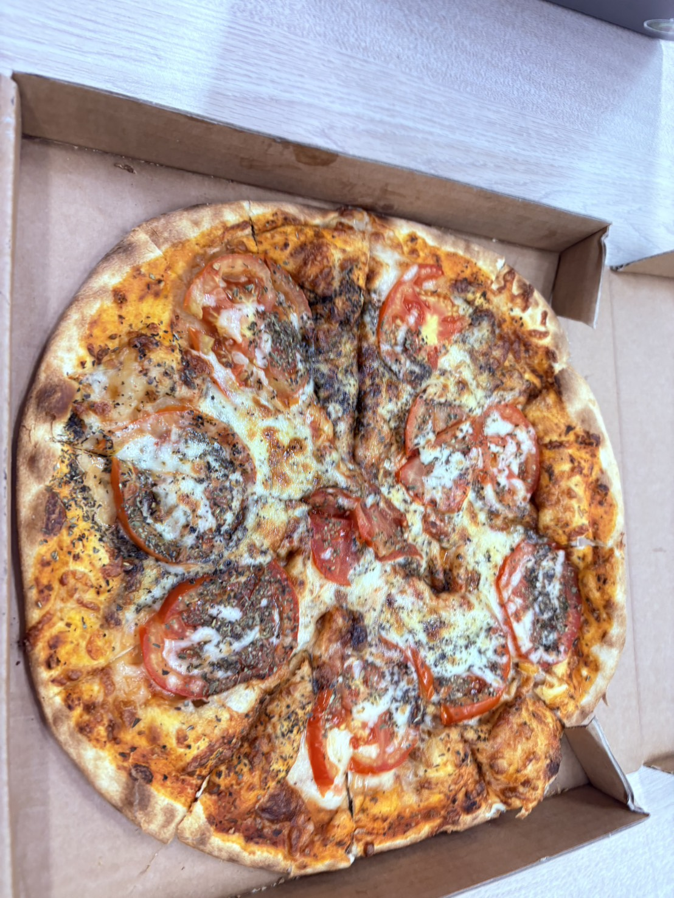
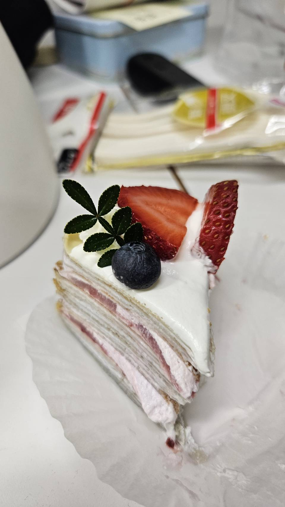
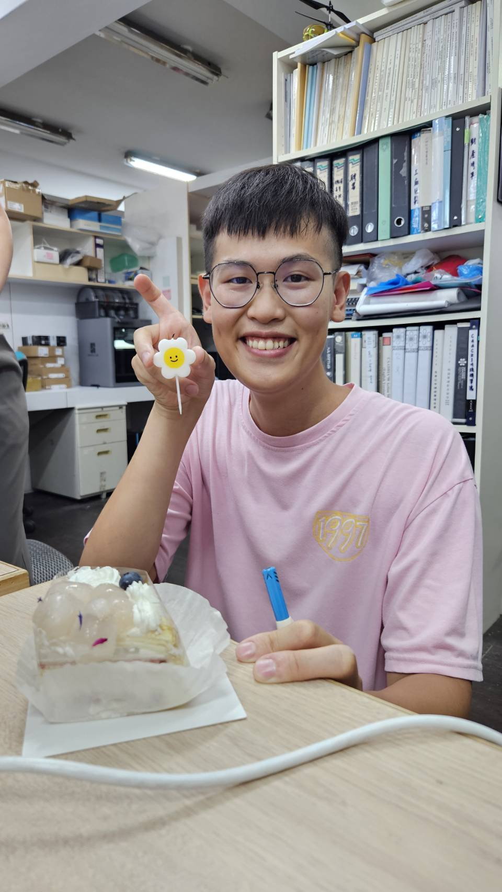

# 迷茫

22歲那年 我陷入了定義的陷阱
在那一整年中 我不知道甚麼是朋友
只覺得是工作夥伴

原本想說請大家吃披薩
就是不期望有所謂的"朋友"
只覺得大家一起工作
就是很快樂的事情了

回頭想想這個想法蠻悲觀且現實主義的

# 生日快樂

## 她的信

深夜
我獨自一人在實驗室
焦頭爛額的與學姊
一起處理大學部期末布展
稍微在茶水室裝水休息的我
開啟了電子郵件
以為又是生日促銷的我

看到了她寫的信
一樣的手繪風格
那溫暖的心意片刻間傳入我的心
我享受在朋友祝福中的溫暖中

她寫道:
獻上(線上?)生日祝福

>嘿bro
>在這個正在慢慢轉換且繁忙的階段
>有點時間沒見你的部落格更新(我有發現排版改變喔!)
>不知道你是否也跟我一樣
>全神貫注在研究及課業上
>在重要的生日時記得喘口氣喔
>生日快樂!

## 南部粽

又是跟平常一樣
學姊們陪我一起忙碌著教授交派的工作

突然Lotus學姊
問我要不要吃南部粽?
我其實也分不清南部粽

> 內陷:香菇,瘦肉,鹹蛋黃,栗子

就這樣我的生日收到了一顆南部粽!

## Pizza Margherita

終於我的披薩到了
我愉快地吃著披薩
但是學姊們都跑去洗手了
我想著披薩會冷掉
還是吃了三大塊Margherita

我吃飽了
想說今年生日先這樣結束吧!
大家都很忙
這樣就很開心(勉強)

但故事卻沒有在這結束
學姊們突然衝出來
跟我說著生日快樂
並拿出不知道從哪來的蛋糕
很精美而且看起來超好吃
而且還有荔枝呢!

我還沒卸下我的防禦
我邊笑同時言語說著
我吃飽了...
很開心...
我覺得拿蛋糕出來拍照非常形式主義...

片刻後,我意識到我可能會傷人
致歉給我的夥伴們
結果他們不在意
只想說 Ezra= 傲嬌罷了!
是我想多了!

我真的很感動
突然被慶生
我也聽他們說
他們在斗六的籽公園買到
但角落很偏僻
所以他們有迷路!!!(心疼)

最後買到了
這個乘載這三年的情誼的生日蛋糕
我真的很幸福!

