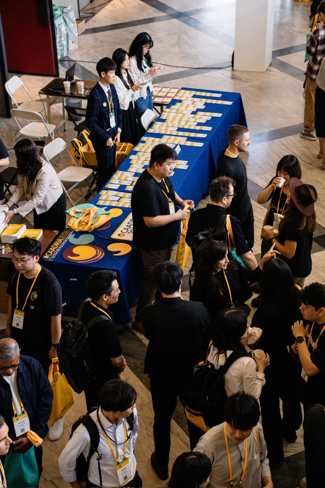
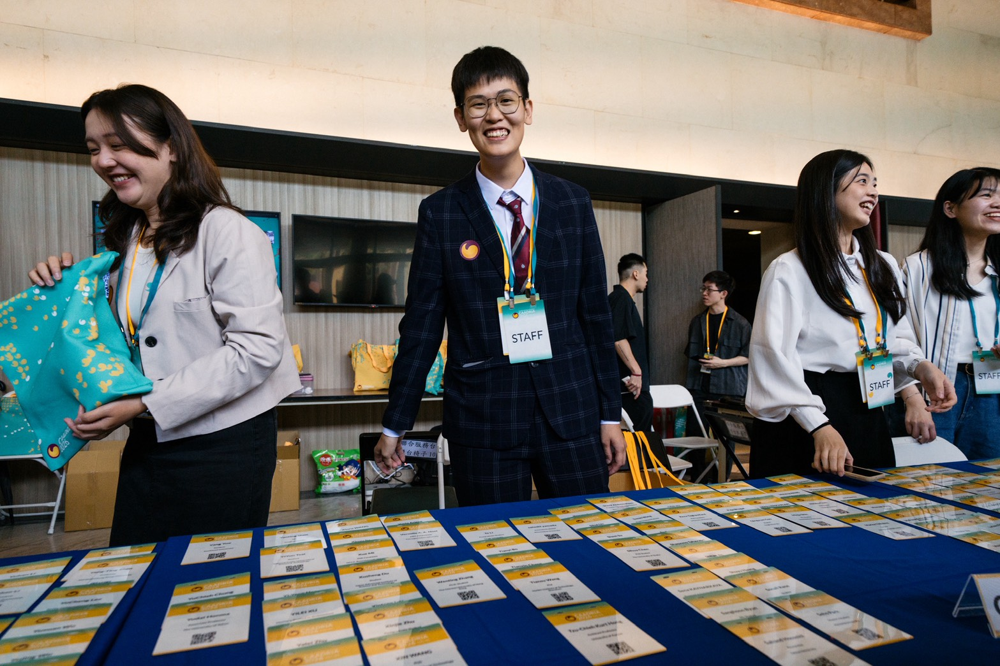
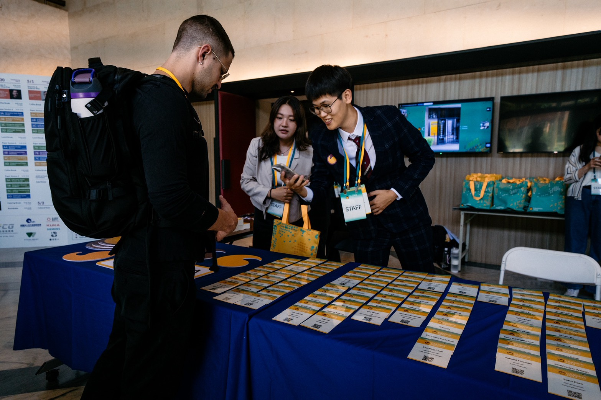
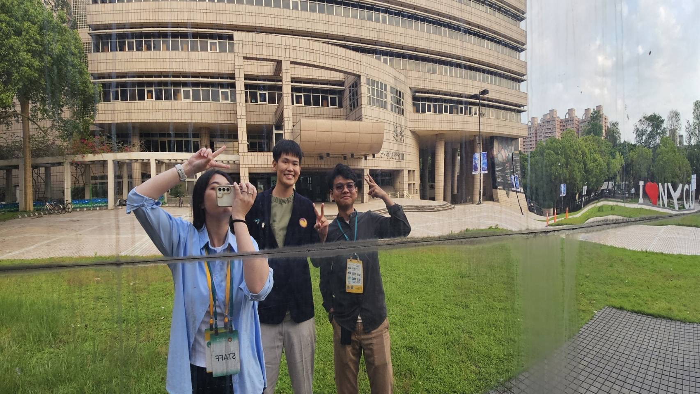
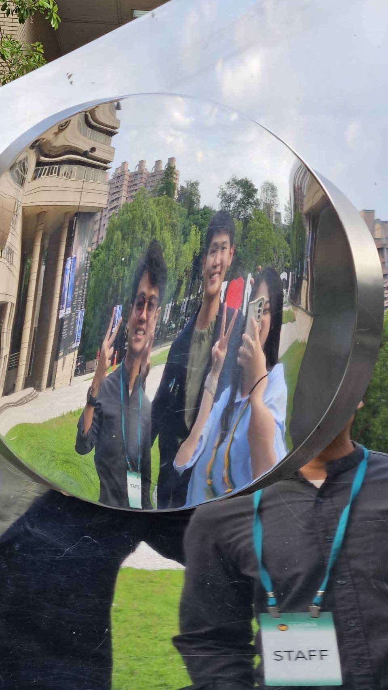

slug: caadria

# 盡力完成，隨時問有需要幫忙嗎?
這些是我學到的事
主動參與研討會並適時提供協助，提升互動與能見度
隨身攜帶筆電並維持在辦公室的在場狀態，展現投入與專業
透過穩定出席與日常交流建立熟悉度，為後續合作奠定基礎
準備名片以利拓展人脈
即使進度有限亦持續參與與露面，累積信任
以開放態度請益與學習
每週固定與指導者交流，維持穩定回饋機制。

## 凡事皆有一體兩面

看研究有沒有問題有沒有被解決掉
有解決掉問題就是好的方法 解決方案
如果沒有解決到問題 代表他的技術還不夠解決問題

能解決問題的方法才是好方法
（老師說不能說唬爛😂)

# 認真 就會被看見

後來 看自己的照片
真的覺得全力以赴的我 好帥
而且 也會因吸引力法則
吸引同樣優秀的人


在工作坊的幾天
雖然 NYCU 都說 不用再請我們幫忙了
但其實 他們自己也很忙
於是 我學到
如何 以感謝的語氣 麻煩他人
以及 全力以赴辦研討會 

## 因為認真 所以遇到同樣認真的你
這是認識到 一個NYCU 土木的男生
他是印尼人 叫做 胡思文
他是第一個住在北部
願意跑下來南部 找我們玩得
而在研討會期間
他也很熱情帶我們逛實驗室
並跟我們分享他熱愛的學校

