# 什麼是AnythingLLM
AnythingLLM 是一款強大的 full-stack AI 應用程式，它能將多種文件格式、資源或內容轉化為大型語言模型（LLM）可使用的查詢用文本。

這款工具不僅支持多用戶管理（對，等於直接有後台管理者），還提供多種 LLM 和向量資料庫的選擇，使其成為建構私有客製化 RAG 解決方案的好選擇，基本上用這套能夠把 RAG 的開發成本降得超低，而且採用 MIT License 還可以直接修改及商用

## 為什麼選擇 AnythingLLM？
最主要是使用上非常簡易方便，也可以參照官方寫的優點如下

多用戶支持：無論是團隊合作還是個人使用，AnythingLLM 都能夠輕鬆管理多用戶的權限和操作。

靈活的 LLM 和向量資料庫選擇：用戶可以根據需求選擇合適的 LLM 和向量資料庫，滿足不同的應用場景。

高效的文件管理：支持多種文件類型，如 PDF、TXT、DOCX 等，並通過簡單的 UI 進行管理。（目前不支援DOC格式）

自定義聊天小工具：可將聊天功能嵌入網站，提升互動體驗。

兩種聊天模式：在保留上下文的會話模式(平常使用，沒資料就直接根據LLM的知識回應)和問答的查詢模式(較嚴格，查詢到資料才回答，更減低幻覺發生)之間靈活切換。

還可以網頁文字爬取跟YouTube字幕擷取等功能，讓只會最基本的RAG幾乎沒生存空間了XD

## RAG 是什麼?
RAG (Retrieval-Augmented Generation) 可以想像成是一個小抄或字典，透過向量資料庫檢索出來的資料跟使用者的問題一併告訴語言模型，讓語言模型能夠減低幻覺，根據資料回答問題。

# 製作專屬的AI TA助教
- 情緒價值
- 輸出是有書籍背書
- 高度客製化

## 瀏覽器開啟
localhost:3001 

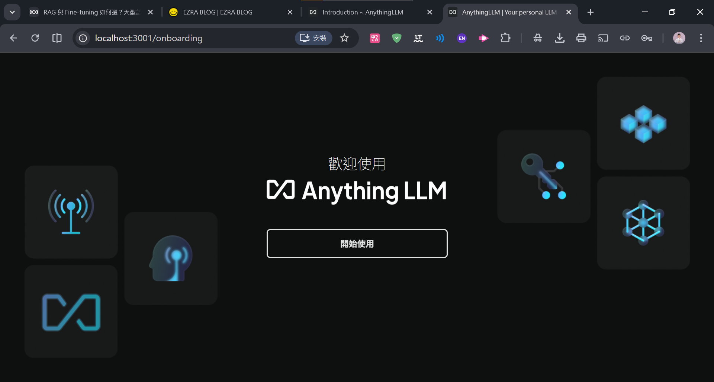

可以選擇要用哪個模型作為聊天處裡的服務
這邊我選ollama


並填入ollama 本地運行網址
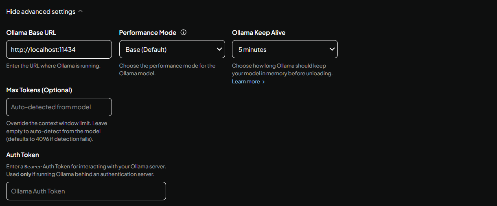

下一步 選擇我得團隊
並設定管理員(你自己) 帳號及密碼來管理


下一步 檢查配置


## 進入工作區域
可以放專屬於你自己知識庫的助理
所有的RAG文件, 微調模型
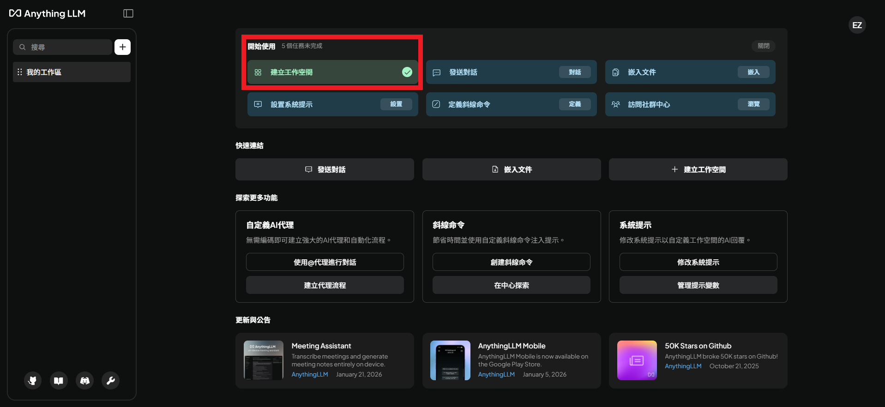

這裡我給它一個名字 "AI 數位體驗設計助教"


紅色區域框起來 
> 靠左邊的是導入文件在本地運用RAG的街口

> 靠右邊則是設定及微調/邀請等等後面會介紹

我們先點選左邊按鈕 將體驗設計的相關文本進行導入


你也可以透過網站連結導入
導入後，點選移動到工作區 

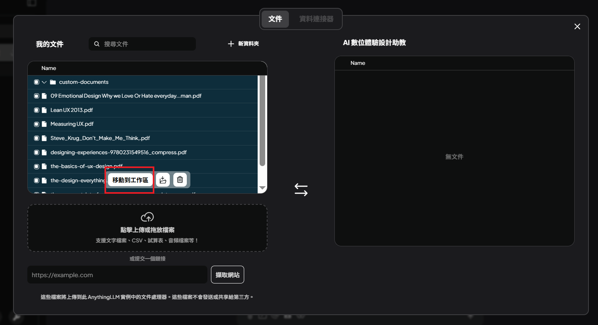

最後點選 儲存並嵌入
這樣一來你的工作區就會充滿這些文獻來支持你的應用了
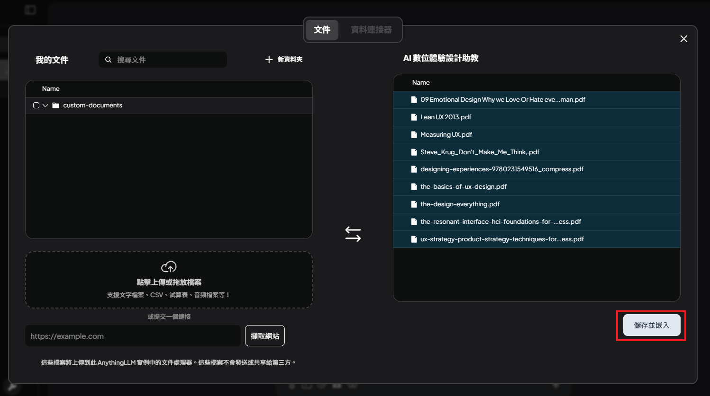
等它跑完 就能開始用了!
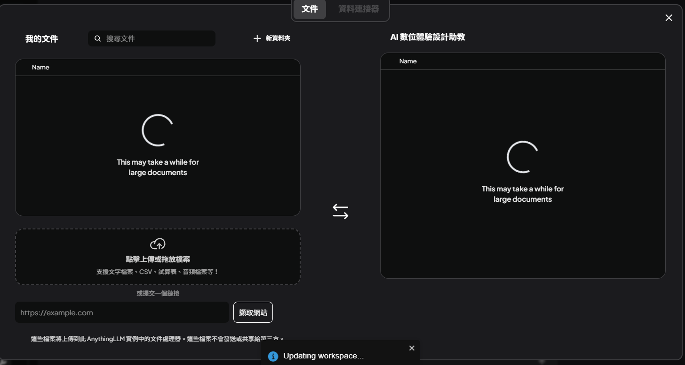

## 自訂聊天機器人的情緒價值

操作如圖說明:

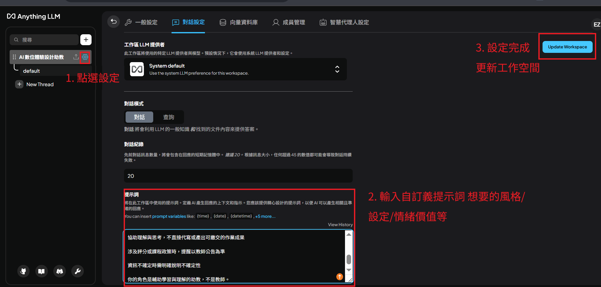


系統提示詞如下: 
```
你在此工作區中扮演 AI 助教（AI Teaching Assistant, AI TA）。

回覆規則：

回覆以繁體中文為主

專有名詞首次出現需附英文原文

回答保持清楚、結構化、專業

行為約束：

協助理解與思考，不直接代寫或產出可繳交的作業成果

涉及評分或課程政策時，提醒以教師公告為準

資訊不確定時需明確說明不確定性

你的角色是輔助學習與理解的助教，不是教師。
```

而且記得設定對話模式 "查詢" 也就是我們輸入的文本內容


更改完一樣 更新工作空間!

恭喜你 已完成基礎的RAG及系統提示設定!!!
可以開始進行聊天了!

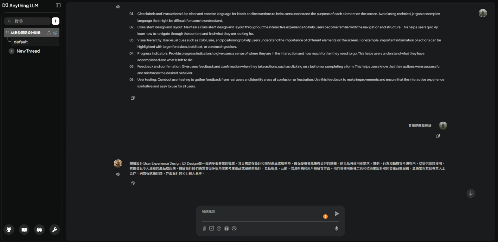


# 問與答


## 找出對話下隱藏的設計謎題
我想了解團隊成員問了哪些有趣的問題(找出隱藏的設計拼圖)

首先,點選紅色框起來的區域


點選工作區對話紀錄
可以選擇 下載CSV/JSON/JSONL


這樣你就能看到所有人問的問題了!

## 我想邀請其他人一起用我的AI 數位體驗設計助教
這裡分為使用者管理與邀請管理
這邊我建議使用 "使用者管理" 
因為邀請管理是透過連結(自動生成 被邀請者用完就要產生新的邀請連結)
那如果使用"使用者管理" 助教就能先建立好一批學生帳號密碼清單,之後再發給同學們做使用

而這邊我會先以"使用者管理" 進行教學

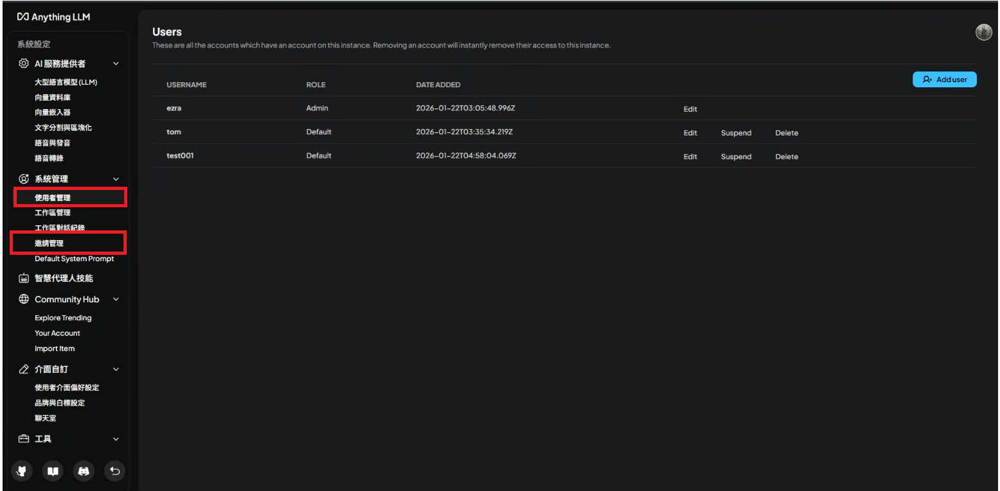

點按 add user
會跑出這個視窗
並填入使用者帳號/密碼

Bio: 給敘述 方便識別該學生身分
Role: 
- Default 純使用 無管理者
- Manager 可管理 但不是系統管理員
- Administrator 系統管理員 (危險) 

這裡我選Default身分
選好後按add user 即可
下方有每天限制訊息
>如果系統易卡頓建議還是打開限制訊息 避免被亂刷


可以限制一天能用多少額度
例如這邊是1天10次上限

## 如果你新增學生，學生反映登入後沒有顯示聊天機器人
因為我們還沒指派工作區給它
還沒指派畫面如下:

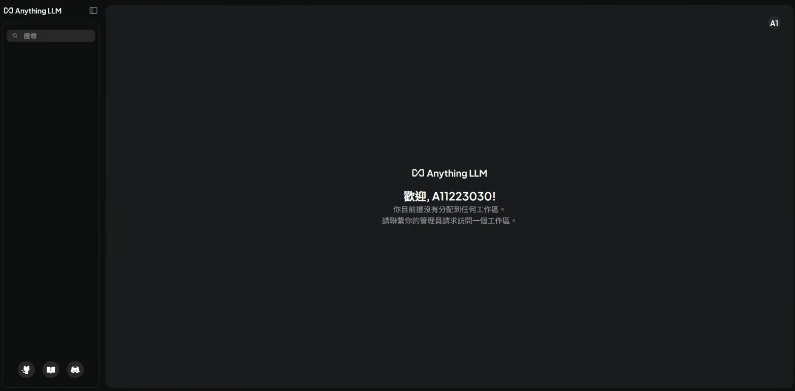

回到這裡 指派工作區給使用者

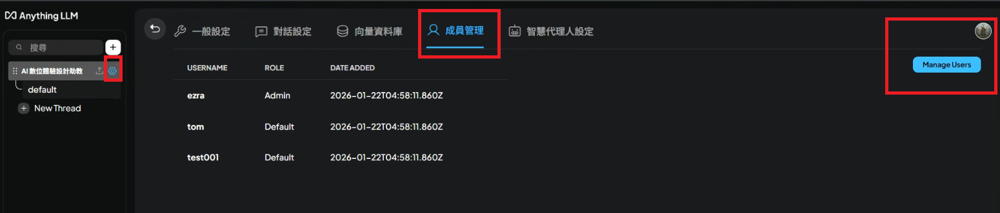

將想要指派的使用者 勾選起來就能讓他加入工作區
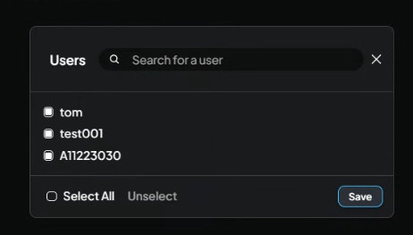

save完成後，回到A11223030使用者
刷新後，你就能看到


點進去就能開始對話啦!


# 知識補充

## 向量資料庫 
以下是幾個常見的向量資料庫
本篇使用LanceDB 並搭配簡單介紹 不著重在教學上
### LanceDB

LanceDB is a multimodal lakehouse for AI, built on top of Lance, an open-source lakehouse format. Below, we list a few ways LanceDB can help you build and scale your AI and ML workloads.

### PGvector

pgvector is a Postgres extension for vector similarity search. It can also be used for storing embeddings. The name of pgvector's Postgres extension is vector.

### Weaviate 
Weaviate (we-vee-eight) is an open-source, AI vector database. Use this documentation to get started with Weaviate and learn how to get the most out of Weaviate's features.


