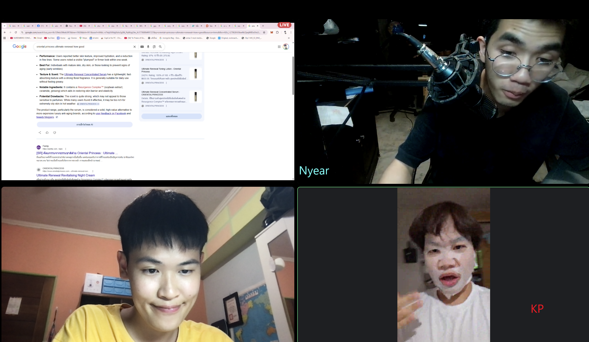
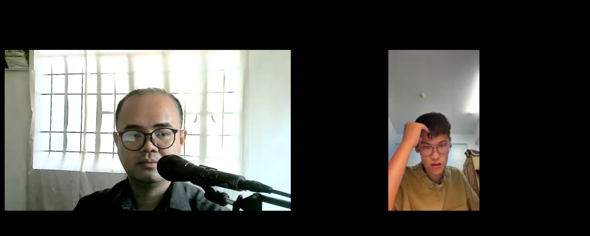

# 當自律成為日常：為了兩個月後的 CAADRIA，我選擇與世界同步

## 翻譯是不夠的

前置補習 減少認知若差
雖然很多人說 大不了你就肢體語言 或是 用翻譯軟體聊天阿
但我曾經管理跨國團隊合作的我 我知道 這遠遠不夠
發音 語言區域隔離性(不同國家 不同用詞偏好 相同語言還是有聽不懂的問題)
此外 一換一翻譯很浪費時間

光是在講一個RICK AND MORTY 的梗
就要請對方等等
我翻譯好在繼續
本質就是對對方國家文化的不尊重 
其實感受最深還是 我曾經德團隊 有個印度人
除了我之外 其他母語人士都懂他的想法
但偏偏我是他最信任的領導

## 我要改變

除了密集與1v1家教補習
我的日常生活就從
起床 英聽
睡覺前 在DISCORD 的英文伺服器與隨機外國人聊天
我也認識了kp 與 NYEAR 來自泰國醫學院及理工名校的男生
我們聊了很多日常對話 也學了泰國軍政府體系 或是 歌曲 食物等等
也學了怎麼用英文吵架 及告白
很有趣的旅程

## 菲律賓的老師

我的英文私教是菲律賓的老師
他擅長辯論 商業英文
這跟我很契合 我熱愛RICK AND MORTY 中RICK 在嘴別人的時候
語速快 看的也很過癮
一開始好久沒說了 25年9月後就沒甚麼說
到現在張口就來
同時也懂很多美劇的梗

雖然很多人笑我 浪費時間浪費錢
但對我而言 沒有真正的浪費
活著就是去探索一切你不知道的事

## 動機

一開始僅僅是因為這簡單的動機 開啟這兩個月的冒險
為了兩個月後的研討會助理工作

