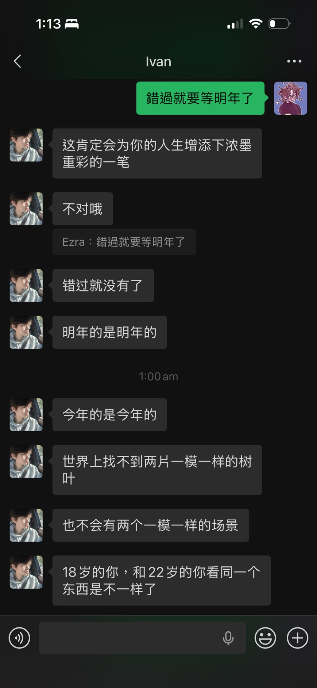
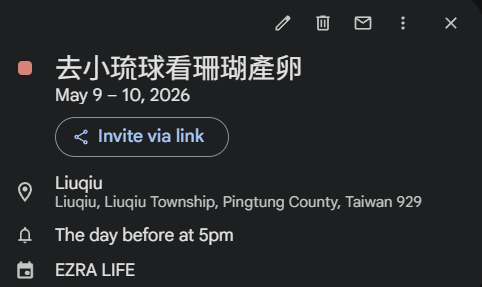

# 生命誕生
一年一次的粉色珊瑚
在周末要進行排卵 05.09.26
深夜在群組看到這個消息的我
萌生一個念頭

我想去看生命誕生
因為 真的好美

## 金錢允許 時間允許 那是甚麼再阻擋我

回憶 與 未來幻想
沒有人阻擋我 
一切只是我的幻想
想去 就去

## 享受 就是現在!
我總是 想著 等一下再享受
但 我現在就擁有一切我值得享受的
我的家人/朋友/興趣/愛好/老師/設計所

那就慢下步調 想去就去吧!

